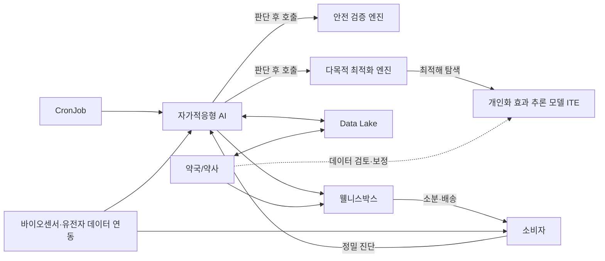
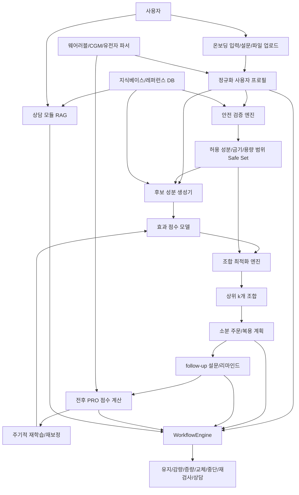
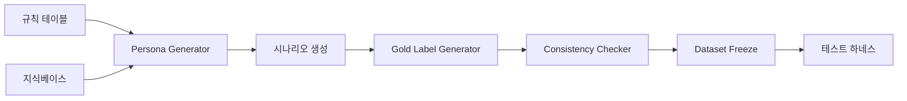

# 웰니스박스 TIPS 연구개발 마스터 컨텍스트 및 재설계 문서

작성 목적: 이 문서는 TIPS 연구개발계획서 원문 중 **연구개발과 직접 관련된 p.1~27만**을 사람이 다시 읽지 않아도 ChatGPT 또는 Codex가 바로 이해하고 작업할 수 있도록, 텍스트 중심으로 재구성한 **LLM용 단일 기준 문서**다.

이 문서의 구성은 두 층으로 나뉜다.

1. **원문 충실 재구성 층**: 원문이 무엇을 말하고 있는지, 페이지별 핵심 내용과 도식 관계를 최대한 손실 없이 텍스트로 재구성한다.
2. **재설계 층**: 원문의 구현 방법은 과감히 바꿔도 된다는 전제 아래, 오직 p.25~26의 성능 지표를 달성하기 위한 **단일 창업자 + 단일 컴퓨터 + 외부 인력 없음** 조건의 현실적인 개발 전략을 새로 설계한다.

---

## 0. 이 문서를 미래의 ChatGPT/Codex에 넘길 때 지켜야 할 운영 규칙

이 문서를 읽는 모든 AI는 아래를 **불변 조건**으로 간주해야 한다.

- 이 프로젝트의 진짜 성공 조건은 원문 p.25~26의 **평가 항목과 목표 수치 달성**이다.
- 원문에 나온 구현 방식, 모델 구조, 데이터 확보 방식, 에이전트 프레임워크는 **전부 변경 가능**하다.
- 원문 p.28 이후 사업화/소개/운영사 설명은 연구개발 수행에는 우선순위가 낮으므로, 본 문서는 p.1~27만 반영한다.
- 외부 전문가 라벨링, 대규모 유저 설문 수집, 외부 개발 인력 투입, 대규모 GPU 인프라 확보를 전제로 하면 안 된다.
- **한 명의 창업자와 한 대의 컴퓨터**만으로 설계해야 한다.
- 가능한 한 다음 원칙을 따른다.
  - 안전 판단은 LLM이 아니라 **규칙 기반/구조화 로직**이 담당한다.
  - 효과 추정은 처음부터 대형 딥러닝이 아니라 **CPU에서 재현 가능한 고전 ML + 점수화 모델**로 시작한다.
  - 에이전트는 멋진 그래프보다 **테스트 가능한 상태기계(state machine)** 가 우선이다.
  - 데이터는 합성 생성, 규칙 생성, 자기 일관성 점검 방식으로 먼저 만든다.
  - 서비스 UI보다 **평가 하네스와 재현성**이 우선이다.
- 이 문서의 페이지 번호는 모두 원문 PDF 기준이다.

---

## 1. 창업자 추가 지시사항(원문 외 별도 제약)

이 항목은 원문 PDF에는 없지만, 실제 수행 시 가장 중요하므로 별도 기록한다.

1. 원문의 설계는 고정이 아니다. 예를 들어 LangGraph가 아니라 PydanticAI, 혹은 둘 다 아닌 순수 상태기계로 바꿔도 된다.
2. 전문가 라벨링 데이터, 실제 유저 설문 학습, 외부 자문 확보를 필수로 가정하지 않는다.
3. 학습 데이터는 직접 수집하지 못하더라도 합성 데이터, 규칙 기반 데이터, 자기생성 데이터로 대체할 수 있다.
4. 모델은 반드시 “대형 end-to-end 학습 모델”일 필요가 없다. 규칙 기반, 검색 기반, 고전 ML, 선형/트리 모델, 조합 최적화만으로도 된다.
5. 최종 목표는 “원문대로 구현”이 아니라 “성능 지표를 만족하는 시스템을 실제로 구현”하는 것이다.
6. 이후 수개월 동안 ChatGPT/Codex가 실제 개발을 수행할 수 있도록, 작업을 분해하고 저장소 구조와 검증 절차까지 명확해야 한다.

---

## 2. 프로젝트 한 줄 요약

프로젝트의 본질은 다음 한 문장으로 정리된다.

> 사용자 개인의 건강 상태, 복용 약물, 생활 습관, 증상, 선택 목적, 선택 가능한 입력 데이터(설문/웨어러블/연속혈당/유전자)를 바탕으로 **안전한 건강기능식품 조합을 찾고**, **그 복용 효과를 수치화하고**, **주기적으로 다시 확인하여 복용 유지·조정·중단을 결정하는 closed-loop 개인 맞춤 케어 시스템**을 만드는 것.

원문이 반복해서 강조하는 핵심은 4개다.

- 건강기능식품은 지금까지 **효과를 수치로 보여주지 못했다**.
- 사용자마다 상태가 다른데도 **안전성/상호작용/과용량을 개인별로 걸러내기 어렵다**.
- 어떤 조합이 가장 좋은지 **선택지 비교가 어렵다**.
- 복용 후 추적과 재조정이 없어서 **지속 관리가 안 된다**.

따라서 시스템은 아래 4가지를 동시에 해야 한다.

1. 개인화된 안전 검증
2. 효과의 정량화
3. 다중 제약 하 최적 조합 탐색
4. 주기적 재평가와 재추천

---

## 3. 원문 충실 재구성: p.1~27 페이지별 상세 요약

### 3.1 p.1 표지

과제명:

- 팁스(TIPS) 창업기업 연구개발계획서(일반트랙)
- 건강기능식품 복용 최적화와 안전 검증을 위한 건강기능식품 특화 Closed-loop AI 알고리즘 개발 및 솔루션 구축

기업 표기:

- 인포뱅크(주)
- (주)웰니스박스

실무적으로 기억해야 할 과제명 핵심 키워드:

- 건강기능식품 특화
- 복용 최적화
- 안전 검증
- Closed-loop AI
- 알고리즘 개발
- 솔루션 구축

### 3.2 p.2 목차

원문 전체 목차는 다음 구조다.

- I. 시장현황 및 문제점
- II. 해결방안 및 세부내용
- III. 사업화 전략
- IV. 창업기업 소개
- V. 연구개발 안전 및 보안조치 이행계획

이 문서에서는 연구개발 관련성이 높은 **I + II + III의 일부 중 p.27까지**만 반영한다. 특히 p.25~26은 평가 지표의 기준점이므로 최우선이다.

---

## 4. 시장현황 및 문제점 요약 (p.3~10)

### 4.1 p.3 건강기능식품 시장의 성장세

원문 메시지:

- 국내 건강기능식품 시장은 고령화와 웰니스 트렌드로 빠르게 성장 중이다.
- 맞춤형 건강관리 수요가 빠르게 확대되고 있다.

원문 수치:

- 건강기능식품 시장 규모: **6조 440억 원**
- 구매 경험률: **82.1%**
- 주요 구매 채널: **인터넷 69.8%**, 약국 **5.2%**

원문 도표를 텍스트로 풀면:

- 시장 규모는 최근 수년간 큰 폭으로 성장했고, 2022~2024 구간 막대그래프는 약 6조 원대 수준을 유지한다.
- 구매 경험률은 2020 80.6 → 2021 81.9 → 2022 82.7 → 2023 81.2 → 2024 82.1로, 매우 높은 보급률을 보여준다.
- 구매 채널 구조에서 인터넷 비중이 압도적으로 높고, 약국 채널은 아직 작다.

R&D 관점 해석:

- 이미 시장은 충분히 크다.
- 문제는 “건강기능식품을 사게 만들 것인가”가 아니라 “**무엇을 어떻게 개인화하고, 안전하게 반복 관리할 것인가**”다.

### 4.2 p.4 건강기능식품 소분 사업 허용

원문 메시지:

- 건강기능식품법 관련 법률 개정으로 **건강기능식품 소분 판매가 합법화**되었다.
- 이 변화는 사용자가 같은 가격에서도 더 적은 분량, 더 다양한 종류를 조합해 섭취할 수 있게 해준다.

원문 포인트:

- 정부가 소비자 건강 수요에 대응하기 위해 맞춤형 건강기능식품판매업을 신설했다.
- 전문가가 상주하는 매장 내 소분 허용, 개인 건강정보 기반 맞춤 상담 가능.
- 2019~2024 시범사업 → 2025.01.03 법제화 → 2025.03.19 세부 시행 규칙 흐름이 제시됨.

R&D 관점 해석:

- 추천 엔진이 단순 “제품 추천”이 아니라 **성분/제형 단위 조합 추천**을 해야 할 이유가 생긴다.
- 즉, 추천 대상이 SKU 완제품이 아니라 **성분 조합 + 용량 + 소분 단위**로 바뀐다.

### 4.3 p.5 약 배송 확대 가능성

원문 메시지:

- 비대면 진료 시장은 빠르게 확산 중이며, 장기적으로 약 배송 서비스 전면 허용 가능성이 높다.
- 이는 온라인 건강기능식품 판매 플랫폼이 장기적으로 일반의약품 판매 범위로 확장될 가능성을 시사한다.

원문 수치/근거:

- 국민 10명당 1명 비대면 진료 이용, 환자수 492만 명, 월 평균 환자수 16만 명.
- 전체 의료기관 중 약 24%가 비대면 진료에 참여.
- 비대면 진료와 함께 약 배송도 허용되어야 한다고 답한 의사 비율 71.7% 제시.

R&D 관점 해석:

- 현재 과제 범위는 건강기능식품이지만, 시스템 구조는 장기적으로 **의약품/일반의약품 확장 가능성**을 고려한 방식이어야 한다.
- 따라서 데이터 스키마, 금기 룰, 복용 이벤트 구조를 너무 건강기능식품 전용으로만 닫아두면 안 된다.

### 4.4 p.6 문제점 2.1: 상품 간 효능 비교 불가

원문 메시지:

- 어떤 영양제를 얼마나, 언제 먹는 것이 좋은지 알 수 없고, 복용 후 실제 효과를 확인할 방법이 없어서 **상품 간 비교가 불가능**하다.
- 비효율과 낭비가 발생한다.

원문 세부 문제:

- 정보 부족: 소비자는 자신의 건강 상태에 맞는 제품을 판단할 정확하고 신뢰할 수 있는 정보가 부족하다.
- 과다 복용: 인당 평균 4.3개 제품 섭취, 최적 섭취량 대비 과도하게 섭취 중인 경우가 42.8%.
- 가격 부담: 완제품 단위 구매 때문에 가격 부담 존재. 가구당 평균 구매액 36만 원 제시.

R&D 관점 해석:

- 시스템은 “무엇을 추천할지”보다 먼저 “**무엇을 빼야 할지**”, “과다 복용인지”, “불필요한 중복인지”를 판단해야 한다.

### 4.5 p.7 문제점 2.2: 건강기능식품 효능의 정량적 파악 어려움

원문 메시지:

- 복용 후 실제 효능의 크기를 파악하기 어렵다.
- 구체적인 수치로 확인할 수 있는 기술이 필요하다.

원문이 제시하는 배경:

- 소비자는 영양제가 필요한지, 효과가 있는지 여부를 모른 채 복용한다.
- 복용/비복용 이유에는 건강 유지, 심리적 안정, 가족 권유, 선물, 질병 개선, 체중 조절 등 다양한 동기가 있다.
- 반대로 “효능 비신뢰”, “돈 낭비”, “운동으로 충분”, “부작용 우려” 때문에 중단하기도 한다.
- 효과감이 좋은 건강기능식품으로 홍삼, 비타민, 종합비타민, 비타민C, 프로바이오틱스, 오메가3 등이 언급된다.

R&D 관점 해석:

- 사용자가 느끼는 체감과 정량 점수 간의 연결고리를 만들어야 한다.
- 따라서 “추천”만이 아니라 **복용 전후 변화량을 표준화 점수로 기록하는 설문/데이터 구조**가 필요하다.

### 4.6 p.8 문제점 2.3: 복용 지속성 저하

원문 메시지:

- 개선 효과를 눈으로 확인하지 못하면 꾸준히 복용할 의지가 떨어진다.
- 수치를 통한 맞춤형 추천과 정밀 케어링이 불가능하다.

원문 도식의 핵심:

- 효과 수치화 X → 선택지 비교 불가 → 최적 선택 불가
- 효과 수치화 X → 꾸준히 복용할 목적 의식 감소 → 복약 순응도 하락
- 복약 후 상태를 모니터링하고 적절한 복용 중단 판단을 하지 못하면 사고 예방이 어렵다.
- 예시로 오메가3 복용 후 중성지방 개선이 있었지만, 이후 멀티비타민 추가로 코피·잇몸출혈 증가 같은 부작용 가능성이 제시된다.

R&D 관점 해석:

- 이 프로젝트의 closed-loop 개념은 “AI가 재밌게 말해주는 챗봇”이 아니라, **복용 후 실제 상태를 다시 보고 다음 행동을 바꾸는 후속 제어 루프**다.

### 4.7 p.9 문제점 2.4: 개인별 복용 안전 관리 문제

원문 메시지:

- 소비자는 명확한 기준을 몰라 금기, 상호작용, 과용량을 걸러내기 어렵다.
- 건강기능식품 부작용 사례가 증가 중이며, 정보 부족으로 약화사고가 생긴다.

원문 수치/근거:

- 건강기능식품 부작용 건수: 2021 1,344 → 2022 1,117 → 2023 1,434 → 2024 2,316
- 소비자 10명 중 3명이 영양제 부작용 경험
- 소비자 6명 중 5명은 복용 중인 영양제의 부작용을 모른다는 조사 이미지 제시
- 식품의약안전처 종합서비스가 있지만 핵심 정보(성분 중복, 상호작용 등)가 부족하다고 지적

R&D 관점 해석:

- 안전 검증 엔진은 이 과제의 부가 기능이 아니라 핵심이다.
- “추천”이 맞더라도 “안전 검증”이 틀리면 전체 시스템 가치가 무너진다.

### 4.8 p.10 문제점 2.5: 허위·과대 광고와 기존 서비스 한계

원문 메시지:

- 건강기능식품 효과를 명확한 숫자로 말하지 못하는 기존 서비스의 허점을 노려 허위·과대 광고가 성행한다.
- 효과를 명확한 숫자로 나타내는 서비스는 존재하지 않는다고 본다.

원문 제시 내용:

- 허위·과대 광고 현황 표와 소비자 불신 조사 이미지 제시.
- 맞춤형 서비스 경쟁사 비교표가 있으며, 공통적으로 다음 한계가 언급된다.
  - 개인별 개선량 비교 불가
  - 최적 조합·용량 결정 불가
  - 사후 관리 부족
  - 실사용 데이터 피드백 약함
  - 안전 경고 위주, 실제 효과 크기/개선량 제공 없음

R&D 관점 해석:

- 차별점은 “AI 추천” 자체가 아니라 **효과 수치화 + 안전 필터 + 조합 최적화 + follow-up 재조정**의 통합이다.

---

## 5. 해결방안 요약 (p.11~15)

### 5.1 p.11 AS-IS → TO-BE

원문이 정의한 AS-IS 문제:

- 안전성·부작용 문제
- 건강기능식품 효과를 수치로 확인할 수 없음
- 어떤 조합이 가장 좋은 선택인지 알 수 없음
- 지속적 모니터링과 후속 관리 불가
- 기존 맞춤형 건기식 서비스들의 한계
- 완제품 단위 판매로 가격 부담, 소비 기한 문제

원문이 제시한 TO-BE 목표:

- 자체 개인화 안전 검증 엔진 개발
- 개인별 건기식 효과의 수치화 모델 개발
- 최적화 엔진을 통한 최적의 소분 조합 제시
- 지속 케어 AI를 통한 세밀한 관리
- 바이오센서·유전 데이터 연동을 통한 정밀 진단
- 소분 형태 구매로 비용 절감 및 신선도 유지

핵심 문장:

> 사용자의 구체적 상태에 따라 어떤 영양제를, 언제, 얼마나 복용할지 정확히 추론·결정하고, 주기적으로 follow-up하며 유지·조정·중단까지 스스로 판단하고 행동하는 사용자 특화 지속 케어 AI.

### 5.2 p.12 Solution 중심 문제 해결 구조도

원문이 문제-해결-효과를 연결하는 방식은 아래와 같다.

#### 원문이 정의한 기존 근본 문제

- 복용 후 효능이 얼마나 나타나는지 확인할 수 없음
- 어떤 선택지가 나에게 개선 효과가 더 큰지 비교 불가
- 효과를 모르니 꾸준한 복용 동기가 하락하고 정밀 케어링 불가
- 효과를 지표로 나타내지 못해 허위·과대 광고가 성행
- 개인의 금기·상호작용·과용량 확인이 번거로워 부작용/약화사고 빈번

#### 원문이 제시한 Solution 구성요소

- 복용 효과를 정량적으로 산출하는 **수치화 모델**
- 개인 특성에 맞는 **최적 영양제 조합 엔진**
- 개선 수치를 기반으로 스스로 판단해 사용자를 **지속 케어하는 AI**
- 상태와 성분 정보를 바탕으로 잘못 복용하지 않도록 **안전화**

#### 원문이 기대하는 연구개발 효과

- 건강기능식품별 복용 시 얻게 될/된 효능을 명확한 수치로 확인 가능
- 나에게 더 높은 개선 효과를 보일 조합을 비교하여 최적 조합 선택 가능
- 주기마다 건강 상태가 얼마나 개선되었는지 지표로 확인 가능
- 정확한 수치만으로 영양제 효과를 나타내 허위·과대 광고 차단
- 모든 고객이 자신 신체 특성에 맞는 영양제를 안전하게 복용 가능

### 5.3 p.13 User 기반 서비스 워크플로우

원문은 사용자가 다음 one-stop 흐름을 경험한다고 정의한다.

- 건강데이터 연동
- 분석
- 소분
- 배송
- 추적·관리

원문이 강조하는 기능:

- 약물 상호작용 데이터를 학습한 AI로 검증된 개인 맞춤 추천
- 소분 구매로 비용 절감 및 신선도 유지
- 단순 추천이 아니라, 복용 후 효과 추적/부작용 관리/재추천까지 포함하는 통합 솔루션

### 5.4 p.14 기술 개발 요약

원문은 시스템을 세 단계로 요약한다.

#### 1) 데이터 수집

- 사용자의 구체적 건강 데이터 수집
- 성별, 연령, 키, 체중, 병력, 증상, 복용 약물, 생활 습관 등
- 공공 건강정보와 연동하여 건강 데이터를 손쉽게 입력 가능

#### 2) 효과 추론 및 조합 추천

- 현재 상태에서 피해야 할 영양제와 상호작용 위험 조합을 사전 필터링
- AI 모델을 활용해 영양제 복용 효과를 숫자로 도출
- 가격, 관심 건강 분야, 종류 제한 등 조건을 반영해 최적 조합과 용량 산출

#### 3) 맞춤형 지속 케어

- AI가 주기적으로 상태를 모니터링
- 복용 유지·조정·중단 판단
- 시스템이 스스로 평가하고 성분별 복용을 조절
- 웨어러블, 연속혈당측정기, 유전자 검사 연동으로 정밀 케어 고도화

### 5.5 p.15 서비스 아키텍처 및 R&D 로드맵(원문 구조)

원문 아키텍처를 텍스트 그래프로 바꾸면 다음과 같다.



원문이 이 페이지에서 정의한 6개 기술 단계:

1. 데이터 레이크 구축
2. 개인화 안전 검증 엔진 개발
3. 개인화 효과 추론 모델(ITE)
4. 다중제약 복용 조합 최적화 엔진
5. 자가적응형 Closed-loop AI
6. 바이오센서·유전자 데이터 연동

원문 해석 포인트:

- 중앙 허브는 “자가적응형 AI”다.
- 안전 엔진, 최적화 엔진, ITE 모델, 데이터 레이크, 약국(약사), 웰니스박스 운영, 센서/유전자 데이터가 모두 연결된다.
- 실제 주문/소분/배송/재주문까지 닫힌 루프를 만든다는 의도다.

---

## 6. 기술개발 내용 및 목표 상세 (p.16~24)

### 6.1 p.16 데이터 레이크 구축

원문 핵심 문장:

> 자가적응형 AI가 판단한 정보를 정확하게 가져올 수 있도록 데이터 형식을 규정하여 단일 저장소에 집약.

원문이 상정한 데이터 레이크 구성요소:

- 사용자 입력 기반 개인 특성 파라미터
  - 성별, 연령, 키, 체중, 병력, 증상, 복용 약물, 생활 습관
- 공공 건강정보/마이데이터 연동 데이터
- 의약학 전문 문헌 데이터
  - Micromedex, USP, Natural Medicines Database 등
  - PubMed, JAMA, Cochrane 등
  - 식약처/약학정보원 안전성 정보
- 유저 행동 패턴 데이터
  - 상품 노출 횟수, 구매 내역, 재구매율, 세션, 리뷰, Push 알림, 열람 통계 등
- 유저 상호작용 로그 데이터
  - 사용자-LLM 대화 로그
- 엔진/모델 연산 결과 데이터
- 외부 요청 데이터 및 탐색·호출 기록

원문 도식의 실질적 의미:

- LLM이 모든 지식을 직접 갖고 있는 것이 아니라, **도메인 특화 단일 저장소**를 중심으로 근거와 사용자 상태를 조회해야 한다.
- 데이터 레이크는 단순 DB가 아니라, 이후 안전 엔진/최적화 엔진/상담 모듈이 공통으로 읽는 **정규화된 지식 허브**다.

### 6.2 p.17 개인화 안전 검증 엔진

원문 핵심 문제 정의:

- 소비자는 라벨이나 검색에만 의존해 금기, 상호작용, 과다 복용 등 안전 리스크를 정확히 판단하기 어렵다.

원문이 제시한 안전 엔진의 3단계:

1. 데이터 수집·정제
   - 사용자 입력, UI/UX, 마이데이터 연동
   - 성별, 연령, 신체 특성, 복용 약물, 질환, 알레르기, 생활 습관, 관심 분야/건강 목표
   - 입력 데이터를 JSON 형태의 구조화 스키마로 변환
2. 규칙 참조·필터링
   - 의약학 DB와 학술지로부터 규칙 테이블 정의
   - 각 규칙을 형식에 맞는 데이터/규칙 테이블로 정리
   - 사용자별 해당 규칙을 순서대로 대조 적용
   - Rule-based matching
3. 개인화 안전 범위 데이터 산출
   - 성분별 복용량 허용 범위
   - 복용 규칙 허용 범위
   - 복용 금기 성분
   - 복용 금기 규칙
   - 이후 단계에서 맞춤형 탐색에 사용

원문 예시 의미:

- 예를 들어 “오메가3 + 멀티비타민 같이 복용하면 안 되는가” 같은 질문에 대해,
- 개인 상태와 규칙을 대조하여 “특정 사용자에게 허용/주의/금지”를 구조화 JSON으로 출력하는 안전 배치를 만들겠다는 뜻이다.

### 6.3 p.18 개인맞춤형 건강기능식품 효능의 정량적 수치화 모델 개발(1)

원문 핵심 목표:

- 개인 특성(신체 특성, 질환, 약물, 생활 습관, 과거 반응)에 대해 특정 성분·용량 제제 효과(Δz)를 계산하여 수치화한다.
- 어떤 선택지가 더 유리한지 정량 비교 가능하게 한다.

원문이 제안한 Step 1: 지도학습 분류·추천 모델

- 사용자의 건강 특성에 가장 잘 맞는 영양제 조합 추천
- 전문가가 추천하는 패턴을 학습해 사용자 특성에 따른 영양제 추천
- 초기에는 효과 데이터가 축적되지 않았으므로 전문가 라벨링 데이터 활용 후 점차 업그레이드
- 초기 모델 예시: **Two-Tower Deep Learning**
- 후보 조합 순위화: similarity score, parameter optimization, GBDT ranking

원문이 제안한 Step 2: 치료 효과 추정(ITE) 모델

- 특정 특성을 가진 사용자가 영양제 조합을 복용했을 때 나타날 효능을 정량적으로 수치화
- 고객 특성 데이터 + 복용 데이터 + 복용 후 효과 변화 데이터를 학습
- PubMed, Micromedex, JAMA, USP 등의 근거를 바탕으로 파라미터 선별
- 최종적으로 효과 수치 집합 C 또는 C' 형태의 예측 벡터를 출력

원문이 전달하고 싶은 본질:

- 추천 모델은 “무엇을 후보로 올릴지”를 맡고,
- ITE 모델은 “그 후보를 먹었을 때 얼마나 나아질지”를 숫자로 예측한다.

### 6.4 p.19 개인맞춤형 건강기능식품 효능의 정량적 수치화 모델 개발(2)

원문은 제제 효과 정량화 절차를 더 상세화한다.

#### 모델 학습 진행 절차

1. 데이터 표준화
   - 개인의 특성 변수들이 공정한 기여도를 가지도록 정규화/표준화
   - 예시: z-점수 표준화
2. 제제 효과 정량화
   - 임상적 타당성을 갖춘 PRO 설문을 통해 각 카테고리별 효과를 측정
   - 상대적으로 더 비교 가능한 z-score/Δscore 형태 데이터셋 생성
   - 예시 설문: PSQI, ISI 등
3. 학습 및 추론
   - 가공된 데이터를 학습하여 새로운 고객에 대한 효능을 예측할 모델 추출
   - ITE 인과추론 기반 개인별 효과 추정

원문 기대효과:

- 특정 개인이 건강기능식품을 복용했을 때 얻을 수 있는 효능의 수치를 정확하게 추론
- 소비자가 실제 효능의 크기를 파악 가능

원문이 구상한 초기 기술 조합:

- Two-Tower로 사용자 조합/제제 조합 임베딩
- GBDT Ranking으로 최적 조합 결정
- 이후 ITE 인과추론 알고리즘으로 개인별 효과 추정

### 6.5 p.20 다중제약 복용 조합 최적화 엔진

원문 핵심 목표:

- 효과는 극대화하고, 부작용·비용·복용 부담은 낮추는 Top-k 조합을 탐색한다.
- 영양제 복용 측면에서 어떤 선택지가 최적인지를 정량적으로 비교 가능하게 한다.

원문 구조를 텍스트로 풀면:

1. 엔진/모델 호출
   - Safety Constraints Engine 호출
   - 개인화 Safe Set 데이터 B' = S(A') 생성
2. 최적해 탐색
   - 목적: 각 제제의 가중치 × 효과 수치 합 최대화
   - 제약 조건:
     - 안전 범위 내
     - 총 비용 ≤ 예산
     - 총 제제 수 ≤ Nmax
   - 구현 후보:
     - Multiple-choice Knapsack 문제로 치환
     - MILP(정수선형계획) 기반 알고리즘
3. 사용자 선택
   - 상위 k개 개인 맞춤 조합 제시
   - 사용자는 가격/알약 개수/선호 등을 보고 선택
   - 이후 주문으로 연결

원문 의도:

- 안전 엔진이 허용한 조합 공간에서,
- ITE 또는 효과 점수 모델이 준 효능 수치와 비용/부작용 패널티를 동시에 고려하여,
- 사용자가 실제 선택 가능한 소수의 대안 집합을 출력하려는 것이다.

### 6.6 p.21 자가적응형 AI(Closed-loop AI) 개발(1)

원문 핵심 목표:

- AI가 스스로 판단하여 사용자의 상태를 주기적으로 수집·평가하고,
- 엔진·모델을 자동 호출해 복용 유지·조정·교체·중단을 결정하며,
- 효과를 수치로 피드백하고 상태 변화에 맞춰 조합·용량을 자동 갱신한다.

원문 도식의 핵심 노드:

- 복용 리마인드
- 주문·배송 과정 안내
- 주기적 검사 요청
- 진단 분석 및 상담
- 질문에 대한 응답
- 메시지 알림 전달
- Data Lake / Web 보강
- Corrective RAG
- LangGraph

원문이 말하는 LangGraph 구조:

- Node: AI의 개별 작업 실행 단위
- Edge: 노드 간 데이터 흐름 경로
- State: 노드 간 주고받는 상태 데이터

원문 본질 해석:

- 중앙 orchestrator가 상태를 보고 다음 노드를 결정하는 멀티노드 에이전트 구조다.
- 그러나 이 페이지의 진짜 요구는 “LangGraph를 써라”가 아니라, **상태 기반 후속 액션 자동화**다.

### 6.7 p.22 자가적응형 AI(Closed-loop AI) 개발(2)

원문은 p.21의 개념을 실제 서비스 노드 구조로 확장한다.

원문 노드 정의:

1. 상담 세션 AI
   - 현재 상태 기반 맞춤형 상담/질의응답 수행
   - LLM, 웹/앱, 카카오톡 알림 등과 연결
2. 검사·측정 요청·연결 AI
   - 정보 부족 혹은 주기적 검사 필요 시 검사/측정 연결
3. 엔진 호출 AI
   - 영양제 추천 또는 안전 복용 범위 탐색이 필요할 때 적절한 엔진 호출
4. 이행·운영 AI
   - 주문/결제/배송 중계, 복용 시기 알림, 모니터링, 재검사/재주문 판단 수행

원문에서 강조하는 요소:

- Push notification / 카카오톡 알림
- 상담 로그를 핵심 키워드 기준으로 Data Lake에 저장
- 주기적 API 호출(CronJob)
- 30일치 소분 주문, 7일 단위 모니터링, 30일 후 재검사, 변경된 소분 조합 재배송 같은 반복 패턴

### 6.8 p.23 바이오센서 연동: 웨어러블 디바이스 및 연속 혈당 측정기

원문 핵심 목표:

- 웨어러블 디바이스와 연속 혈당 측정기 연동으로 더 정확하고 객관적인 진단/추천을 가능하게 한다.
- PRO 기반 자기진단 정확성의 한계를 해소한다.

원문이 말하는 측정 가능 지표 예시:

- 웨어러블
  - 활동량
  - 심박수
  - 수면 시간 등
- 연속혈당측정기(CGM)
  - 혈당 수치
  - TIR(Time in Range)

원문 예시 수치:

- 평균 심박수 78 → 72 bpm (Δ = -6)
- 수면 시간 6.0 → 7.2h (Δ = +1.2)
- 혈당 148 → 135 (Δ = -13)
- TIR 62% → 78% (Δ = +16)

원문이 제안한 고도화 방식:

- 수집된 웨어러블/혈당 데이터를 개인별 피드백 루프로 재활용
- ITE 추론 모델을 주기적으로 재학습(원문 표현상 online fine-tuning)
- 새로 측정된 생체 지표를 기존 효과 데이터와 함께 학습시켜 개인화 성능 향상
- 업데이트된 모델을 closed-loop 구조로 실시간 효과 예측에 재적용

### 6.9 p.24 유전자 검사 데이터 연동

원문 핵심 목표:

- 유전자 검사 데이터 연동을 통해 개인별 영양소 흡수·대사력 차이를 반영한 정밀 추천/상담을 수행한다.
- 미래 건강 위험도 예측과 개인 맞춤형 알고리즘 조정을 한다.

원문 배경 지식:

- 영양소 흡수와 대사력에 큰 영향을 미치는 유전자가 존재하고, 카페인 대사 등도 개인차가 크다.
- 저렴한 유전자 키트 검사로 개인 유전자를 고려한 케어가 가능해진다고 본다.

원문 처리 흐름:

- 소비자가 검사 신청
- 타액/구강상피세포 채취
- 외부 검사기관(예: Genoplan) 검사
- 결과 파라미터 벡터 X 수령
- 안전 검증 엔진/다목적 최적화 엔진의 규칙과 가중치 조정
- 결과를 Data Lake에 저장
- 이후 추천 모델 재학습 시 개인 특성 파라미터에 반영

원문 표에 제시된 유전자 예시와 조정 방향:

#### 흡수·대사 효율 유전자

- MTHFR: 엽산 대사력이 선천적으로 낮음 → 합성 엽산 대신 대체 제형 가중치 상향 조정
- LCT(유당불내증): 유당 소화력이 선천적으로 낮음 → 유당 함유 영양제 제외, 무유당 칼슘·비타민D 대체
- CYP1A2(느린 대사): 카페인 민감도가 선천적으로 높음 → 각성제 계열 축소, L-테아닌·폴리페놀 우선

#### 미래 위험 경향 유전자

- FTO: 체중 증가 경향이 선천적으로 높음 → 고당·고열량 보충 축소, 단백질·식이섬유 우선
- TCF7L2: 식후 혈당 상승치가 선천적으로 높음 → 당분 기반 성분 축소, 식후 혈당 모니터링 확대
- LPL(불리형): 중성지방 상승치가 선천적으로 높음 → 정제탄수 보충 축소, 오메가3 추천 가중치 상향

---

## 7. 평가 지표와 평가 방법: 이 프로젝트의 절대 기준 (p.25~26)

이 섹션은 가장 중요하다. 앞으로 모든 개발과 의사결정은 이 KPI들을 만족하는 방향으로만 진행한다.

### 7.1 평가 항목 요약표

#### 1) 건강기능식품 추천 정확도

- 단위: %
- 목표: **80%**
- 가중치: 20
- 의미: 동일 사용자에 대해 사람이 만든 정답 조합 성분 세트와 엔진 추천 성분 세트 간의 일치율

#### 2) 엔진 추천 복용을 통한 실제 효과 측정치 개선도

- 단위: pp
- 목표: **0pp 초과(효과가 유의함)**
- 가중치: 20
- 의미: 복용 전후 표준화된 PRO 점수 차이를 백분위 포인트로 환산한 값의 평균이 양수여야 함

#### 3) Closed-loop AI의 다음 수행 작업 판단 및 수행 정확도

- 단위: %
- 목표: **80%**
- 가중치: 20
- 의미: 추천, 리마인드, 상담, 주문 연결 등 다음 행동을 올바르게 판단하고 실행하는지

#### 4) Closed-loop AI 중 상담 모듈(대화형 LLM)의 답변 정확도

- 단위: %
- 목표: **91%**
- 가중치: 20
- 의미: 테스트 질문 세트에서 올바른 답변 비율

#### 5) 안전 검증 엔진 제공 데이터 및 데이터 레이크 레퍼런스 정확도

- 단위: %
- 목표: **95%**
- 가중치: 10
- 의미: 추론된 규칙과 근거 레퍼런스가 참조 규칙과 일치하는지

#### 6) 엔진 추천 건강기능식품 복용으로 인한 약물이상반응 보고 건수

- 단위: 건/year
- 목표: **연 5건 이하**
- 가중치: 5
- 의미: 시스템 추천 복용 후 사용자 보고 adverse event 수를 낮게 관리할 것

#### 7) 바이오센서·유전자 데이터 연동율

- 단위: %
- 목표: **90%**
- 가중치: 5
- 의미: 웨어러블, 연속혈당측정기, 유전자 데이터가 Data Lake에 성공적으로 반영된 비율

### 7.2 p.26 측정 방식의 수식 해석

원문 수식을 구현 가능한 형태로 ASCII로 재정리한다.

#### A. 건강기능식품 추천 정확도

- 약사 그룹이 도출한 성분 집합을 `R_i`
- 엔진이 산출한 복용 조합의 성분 합집합을 `T_i`
- 개별 점수 `s_i = 100 * |R_i ∩ T_i| / |R_i|`
- 전체 점수 `Score = (1/N) * Σ s_i`
- 통과 기준: 최소 100 case 이상, 평균 80% 이상

실무 해석:

- 완전 일치가 아니라 **정답 성분 세트를 얼마나 많이 포함했는가**가 핵심이다.
- 따라서 추천 정확도는 “순서”가 아니라 **성분 커버리지 문제**다.

#### B. 실제 효과 측정치 개선도

- 복용 전 표준화 점수 `z_pre,i`
- 복용 후 표준화 점수 `z_post,i`
- 원문은 표준정규분포 CDF `Φ`를 이용해 백분위 포인트 차이를 계산한다.
- 개별 개선도는 대략 `p_i = 100 * [Φ(z_post,i) - Φ(z_pre,i)]` 형태로 이해 가능
- 전체 개선도 `SCGI = (1/N) * Σ p_i`
- 통과 기준: 최소 100쌍 이상의 복용 전후 PRO 확보, 평균 Δz 또는 pp가 0 초과

실무 해석:

- 이 지표는 “절대 효과의 임상 대단함”보다 **전후 비교에서 평균이 좋아졌는가**를 본다.
- 즉, 매우 복잡한 causal model 없이도 **안정적인 표준화 점수 체계와 follow-up 구조**만 잘 만들면 달성 가능성이 높다.

#### C. 다음 수행 작업 판단 및 수행 정확도

- 전체 테스트 수행 작업 집합을 `S`
- 정답 작업 `a_s*`, 시스템 수행 작업 `a_s`
- 성공 플래그 `e_s ∈ {0,1}`
- Accuracy = `100 * Σ [e_s * 1(a_s = a_s* ∧ e_s = 1)] / |S|`
- 통과 기준: 최소 100 case, 정확도 80% 이상

실무 해석:

- “다음 행동을 고르는 정책”이 핵심이다.
- 자유로운 agent보다 **명확한 상태기계**가 훨씬 유리하다.

#### D. 상담 모듈 답변 정확도

- 질문 집합 `Q`
- 답변 적합성 판단 함수 `g(answer_q) ∈ {0,1}`
- Accuracy = `100 * Σ g(answer_q) / |Q|`
- 통과 기준: 최소 100문항, 정답 일치율 91% 이상

실무 해석:

- 범위를 좁히고, 검색 결과를 강하게 통제하며, 모를 때 모른다고 말하게 하면 달성 가능하다.

#### E. 안전 검증 엔진/레퍼런스 정확도

- 표본 규칙 `r = 1...R`
- 엔진이 산출한 논리 `l_r`, 레퍼런스 `f_r`
- 참조 규칙 `l_ref`, `f_ref`
- Accuracy = `100 * (1/R) * Σ 1(l_r = l_ref ∧ f_r = f_ref)`
- 통과 기준: 최소 100개 규칙 샘플, 일치율 95% 이상

실무 해석:

- 이 지표는 LLM 답변 품질 문제가 아니라 **규칙 엔진과 근거 연결 품질 문제**다.
- 따라서 반드시 구조화 룰과 구조화 citation 체계를 만들어야 한다.

#### F. 약물이상반응 보고 건수

- 연간 누적 사용자 보고 adverse event 수 합계
- 통과 기준: 측정 시점 기준 직전 12개월 누적 5건 이하

실무 해석:

- 초기 서비스 범위를 보수적으로 잡고, 고위험 케이스를 차단해야 한다.

#### G. 바이오센서·유전자 데이터 연동율

- 데이터 집합 `s ∈ {W, C, G}`
  - W: 웨어러블
  - C: 연속 혈당 측정기
  - G: 유전자 검사
- 각 집합 연동율 `r_s = 100 * (성공적 연결 수) / (전체 집합 수)`
- 전체 비율 `R = (r_W + r_C + r_G) / 3`
- 통과 기준: 최소 100개 데이터셋, W/C/G 각 10세트 이상 포함, 평균 90% 이상

실무 해석:

- 이 지표는 의학적 정확성보다 **파싱·매핑 성공률**에 가깝다.
- 표준 입력 포맷만 정하면 단기간에 달성 가능하다.

---

## 8. p.27 개발 로드맵의 의미

원문 p.27은 연도별 개발 로드맵을 제시한다.

### 2025

- 건강기능식품 소분 판매 플랫폼 ‘웰니스박스’ 개발
- 전문가 추천 알고리즘 활용 AI 모델 및 진단 검사 프로토타입 개발
- 개인 맞춤형 추천·상담 AI 챗봇 프로토타입 개발

### 2026

- 데이터 레이크 구축
- 개인화 안전 검증 엔진 개발
- 개인맞춤형 건강기능식품 효능 정량적 수치화 모델 개발

### 2027

- 바이오센서 연동(웨어러블/연속혈당)
- 유전자 검사 데이터 연동
- 다중제약 복용 조합 최적화 엔진 개발
- 자가적응형 Closed-loop AI 시스템 개발

### 2028

- 사용자 일반의약품/전문의약품 복용 데이터 수집(확장 목표)
- 연동 가능한 진단 기기 종류 확장
- 일반의약품 효능 추론 및 추천 시스템 개발
- 건강기능식품 실시간 추천 시스템 개발
- AI 케어링 시스템 정확도 향상 고도화 작업

### 2029

- 외부에서 유료 사용 가능한 데이터 시스템 구축(제약회사 등 대상)
- 일반의약품 범위 확장 Closed-loop AI 시스템 개발

이 로드맵의 실무적 교훈:

- 원문은 장기적으로 일반의약품까지 확장하려 하지만,
- 지금 당장 p.25~26 KPI를 달성하는 데 필요한 최소 범위는 **건강기능식품 한정 + 구조화 데이터 + 후속관리**다.

---

## 9. 원문 전체를 한 문장으로 다시 압축한 기술 요구사항

원문 p.1~27을 기술 요구사항으로 바꾸면 아래와 같다.

1. 사용자 프로필을 구조화 입력으로 받는다.
2. 사용자 상태와 성분/약물/질환 규칙을 대조하여 금기/상호작용/허용범위를 계산한다.
3. 안전 범위 내에서 사용자 목표별 후보 성분을 뽑는다.
4. 각 후보 또는 조합의 기대 효과를 표준화된 점수로 수치화한다.
5. 비용/복용부담/최대 제제 수 같은 제약을 반영해 Top-k 조합을 탐색한다.
6. 사용자는 소분 조합을 선택하고 복용한다.
7. 시스템은 주기적으로 follow-up을 수행한다.
8. follow-up 결과를 전후 비교 지표로 환산한다.
9. 그 결과에 따라 유지/증량/감량/교체/중단/재검사/상담 같은 다음 행동을 결정한다.
10. 이 전 과정을 반복한다.

---

## 10. 무엇이 고정이고 무엇이 바뀌어도 되는가

### 10.1 절대 고정

- p.25~26 KPI 정의와 목표 수치
- 효과를 전후 비교로 수치화해야 한다는 요구
- 안전 검증이 핵심이라는 요구
- Top-k 조합을 제시해야 한다는 요구
- closed-loop follow-up이 있어야 한다는 요구
- 바이오센서/유전자 데이터 연동율 KPI

### 10.2 변경 가능

- LangGraph 사용 여부
- PydanticAI 사용 여부
- Two-Tower/ITE/ONNX 구조 유지 여부
- 대형 LLM 중심 구조 여부
- 전문가 라벨링 데이터 확보 방식
- 실제 유저 데이터 비중
- 온라인 파인튜닝 여부
- UI 스택, 벡터DB, 데이터레이크 구현체
- 완제품 중심/성분 중심 내부 표현 방식

### 10.3 실제로는 바꾸는 편이 좋은 것

- 중앙 자가적응형 AI를 자유형 agent graph로 구현하는 것
- 초기부터 대형 딥러닝 추천 모델을 학습하는 것
- 온라인 파인튜닝을 반드시 해야 한다고 가정하는 것
- 건강기능식품 수백 종, 의약품까지 한 번에 커버하려는 것
- 실제 전문가 집단 라벨링을 선행조건으로 두는 것

---

## 11. 단일 창업자 + 단일 컴퓨터 조건에서의 재설계 원칙

이제부터는 원문 재현이 아니라 **목표 달성을 위한 새 설계**다.

### 11.1 새 설계의 핵심 논리

이 과제의 KPI는 다음과 같은 구조를 가진다.

- 안전 엔진 정확도는 **구조화 룰과 레퍼런스 일치율** 문제다.
- 추천 정확도는 **정답 성분 세트 커버리지** 문제다.
- 다음 행동 정확도는 **상태 전이 정책** 문제다.
- 상담 정확도는 **좁은 범위의 검색·응답 품질** 문제다.
- 효과 개선도는 **전후 점수 체계 + follow-up 루프** 문제다.
- 센서/유전자 연동율은 **파서/매퍼 성공률** 문제다.

즉, 대부분의 KPI는 “거대 모델을 잘 학습시키는 일”보다,

- 스키마를 잘 정하고,
- 규칙을 잘 구조화하고,
- 테스트셋을 잘 만들고,
- 상태기계를 잘 구현하는 일에 더 가깝다.

### 11.2 따라서 새 구조는 다음으로 간다

1. **안전 검증 = 완전 구조화 규칙 엔진**
2. **추천 = 규칙 기반 후보 생성 + 경량 점수 모델**
3. **조합 최적화 = OR-Tools/정수계획 기반 탐색**
4. **효과 추정 = 도메인별 표준화 점수 + CPU 친화적 트리 모델**
5. **Closed-loop = 명시적 상태기계**
6. **상담 = RAG + 답변 검증 + 템플릿 중심 LLM**
7. **데이터 = 합성 생성 + 규칙 생성 + 자기 일관성 검증**

### 11.3 버려야 할 환상

- “처음부터 ITE 인과모델을 대규모 실데이터로 학습해야만 한다” → 아니다.
- “LangGraph 같은 에이전트 그래프가 있어야만 closed-loop AI다” → 아니다.
- “전문가 라벨러가 없으면 추천 정확도 지표를 만들 수 없다” → 아니다.
- “실시간 바이오센서 데이터가 없으면 효과 수치화가 불가능하다” → 아니다.
- “대형 모델 파인튜닝이 없으면 상담 정확도 91%는 불가능하다” → 아니다.

---

## 12. 제안하는 최종 아키텍처(재설계안)

### 12.1 한 줄 설명

> **안전은 규칙 엔진, 추천은 경량 점수 모델, 조합은 최적화 엔진, 대화는 RAG 상담 모듈, 후속관리는 상태기계**로 분리한다.

### 12.2 권장 기술 선택

- 백엔드: Python + FastAPI
- 데이터 저장: SQLite(초기), Parquet/JSONL(실험 데이터), 필요시 DuckDB 분석
- 스키마/검증: Pydantic
- 작업 스케줄링: APScheduler 또는 cron
- 최적화: OR-Tools CP-SAT / MILP
- ML: scikit-learn, XGBoost/LightGBM/CatBoost 중 CPU 친화 모델
- 검색/RAG: 로컬 문서 인덱스 + BM25/벡터 혼합 검색
- LLM 계층: 상담 모듈에만 사용, 나머지 핵심 판정은 비LLM화
- 오케스트레이션: LangGraph 대신 **명시적 WorkflowEngine(State Machine)**

### 12.3 왜 LangGraph보다 상태기계가 유리한가

원문은 LangGraph를 중앙 오케스트레이터로 상정했지만, 단일 창업자 조건에서는 다음 이유로 상태기계가 더 좋다.

- 다음 수행 작업 정확도 80%는 자유형 agent보다 **결정적 로직**이 유리하다.
- 디버깅과 회귀 테스트가 쉽다.
- 주문/리마인드/재검사 같은 실제 운영 이벤트는 그래프 탐색보다 **이벤트-상태 전이**로 쓰는 편이 안정적이다.
- LLM이 다음 행동을 결정하게 하면 안전 리스크와 재현성 문제가 커진다.

### 12.4 재설계 아키텍처 다이어그램



### 12.5 이 구조의 장점

- 안전성과 추천 로직이 분리되어 해석 가능하다.
- LLM 오류가 안전 판정에 직접 영향을 주지 않는다.
- 각 KPI를 개별 모듈 테스트로 분해할 수 있다.
- 단일 컴퓨터에서 학습/검증 가능하다.
- 장기적으로 데이터가 쌓이면 점수 모델만 조금씩 고도화하면 된다.

---

## 13. 시스템 모듈 상세 설계

### 13.1 모듈 A: 정규화 입력 계층

입력 종류:

- 기본 인적 정보: 성별, 연령, 키, 체중
- 건강 상태: 병력, 현재 증상, 진단명 여부, 알레르기
- 복용 정보: 현재 복용 약물, 현재 복용 영양제, 복용 이유
- 생활 습관: 수면, 운동, 음주, 흡연, 카페인, 식습관
- 목표: 수면 개선, 피로 개선, 장 건강, 혈당 관리, 체중 관리 등
- 예산/복용 부담: 월 예산, 하루 최대 알약 수, 선호 제형
- 선택적 데이터: 웨어러블 CSV/JSON, CGM CSV/JSON, 유전자 결과 JSON/템플릿 CSV

권장 내부 스키마 예시:

```yaml
user_profile:
  demographics:
    sex: female|male|other
    age: int
    height_cm: float
    weight_kg: float
  conditions: [string]
  symptoms: [string]
  medications: [string]
  allergies: [string]
  current_supplements: [string]
  habits:
    sleep_hours: float
    caffeine_level: low|mid|high
    smoking: bool
    alcohol: low|mid|high
    exercise_level: low|mid|high
  goals:
    primary: [sleep, stress, energy, bowel, metabolic, etc]
    secondary: [string]
  constraints:
    monthly_budget_krw: int
    max_pills_per_day: int
    preferred_forms: [capsule, powder, liquid, etc]
  optional_data:
    wearable_available: bool
    cgm_available: bool
    gene_available: bool
```

핵심 원칙:

- UI에서 자유 텍스트를 받아도 내부에서는 반드시 **정규화된 enum/코드**로 변환한다.
- 이 계층이 흔들리면 아래 모든 엔진이 흔들린다.

### 13.2 모듈 B: 안전 검증 엔진

이 모듈이 해야 할 일:

1. 금기 성분 필터링
2. 약물-성분 상호작용 필터링
3. 질환-성분 상호작용 필터링
4. 과용량/중복성분 체크
5. 허용 범위와 주의 범위 출력
6. 각 판단에 대응하는 근거 레퍼런스 연결

권장 구현 방식:

- LLM이 아니라 **YAML/JSON 규칙 DSL**
- 각 규칙은 다음 필드를 가진다.

```yaml
rule_id: R-000123
rule_type: contraindication|interaction|dose_limit|duplication|caution
if:
  medications_any: [warfarin]
  ingredients_any: [omega3]
then:
  action: caution|block|limit
  max_dose_mg: 1000
  message_template: "항응고제 복용 시 고용량 오메가3 주의"
reference_ids: [REF-102, REF-208]
priority: 80
```

출력 예시:

```json
{
  "allowed_ingredients": ["magnesium_glycinate", "probiotic"],
  "blocked_ingredients": ["ingredient_x"],
  "dose_limits": {
    "omega3": {"max_per_day_mg": 1000}
  },
  "cautions": [
    {
      "ingredient": "omega3",
      "reason": "medication interaction",
      "reference_ids": ["REF-102"]
    }
  ]
}
```

이 모듈이 KPI에 기여하는 방식:

- 레퍼런스 정확도 95%를 직접 책임진다.
- adverse event 보고 건수 최소화에도 가장 직접적으로 기여한다.

### 13.3 모듈 C: 후보 성분 생성기

역할:

- 사용자 목표/증상/안전 범위 안에서 추천 후보 성분을 먼저 좁힌다.

핵심 아이디어:

- 처음부터 조합 최적화에 모든 성분을 넣지 말고,
- **목표별 후보군 생성 → 안전 필터 후 축소 → 그 안에서 최적화** 순서로 간다.

예시 흐름:

1. 목표가 수면 개선이면 관련 후보군 테이블 조회
2. 사용자 증상/생활 습관/현재 복용 제품과 대조
3. 금기/과용량/중복 제거
4. 남은 성분에 기본 prior score 부여
5. 상위 n개만 최적화 엔진으로 넘김

권장 구현:

- 규칙 + 간단한 ML 점수 모델 혼합
- 처음에는 완전 규칙 기반으로 시작 가능

### 13.4 모듈 D: 효과 점수 모델(원문의 ITE 기능을 현실적으로 축소 구현)

원문은 ITE 인과추론 모델을 제안했지만, 단일 창업자 환경에서는 아래처럼 구현하는 편이 현실적이다.

#### 1단계: 규칙 기반 점수 모델

- 성분별 예상 도움 도메인을 정의
- 사용자 상태와의 적합도를 계산
- 중복/상충/복용 부담 패널티 반영
- 결과를 `expected_delta_score`로 출력

예시:

```yaml
ingredient: magnesium_glycinate
helps_domains: [sleep, stress]
base_score:
  sleep: 0.42
  stress: 0.31
penalties:
  pill_burden: 0.05
  cost: 0.02
boost_conditions:
  - if: symptom_insomnia
    add: {sleep: 0.18}
  - if: sleep_hours_below: 6
    add: {sleep: 0.12}
```

#### 2단계: CPU 친화 ML 모델

- 입력: 정규화 사용자 프로필 + 성분/조합 피처
- 출력: 도메인별 예상 개선량 벡터
- 추천 알고리즘 후보:
  - XGBoost 회귀
  - LightGBM 회귀
  - CatBoost 회귀
  - 로지스틱/선형 회귀(베이스라인)

#### 3단계: 누적 데이터로 보정

- 실제 follow-up 결과로 예측 오차를 기록
- 월 1회 또는 주 1회 배치 재학습
- 원문의 online fine-tuning을 **배치 재보정(batch recalibration)** 으로 대체

중요한 현실 판단:

- p.25~26 지표는 “ITE라는 이름의 causal model이 있느냐”를 보지 않는다.
- 결국 필요한 것은 **전후 개선이 양수이고, 추천 정답률이 일정 수준 이상인 구조**다.

### 13.5 모듈 E: 조합 최적화 엔진

입력:

- Safe set
- 후보 성분 리스트
- 각 성분/조합의 기대 효과 점수
- 비용
- 알약 수/제형 부담
- 사용자 선호 및 제약

출력:

- 상위 k개 조합
- 조합별 점수 세부 설명
- 선택 이유
- 제외 이유

목적함수 예시:

`maximize total_effect_score - λ1*cost - λ2*pill_burden - λ3*redundancy_penalty`

제약식 예시:

- 금지 성분 포함 금지
- 총 비용 ≤ 예산
- 총 알약 수 ≤ max_pills_per_day
- 같은 기능의 중복 성분 개수 제한
- 특정 성분은 반드시/반드시 제외 등의 조건 반영

권장 구현:

- OR-Tools CP-SAT 또는 MILP
- 후보 수가 작으면 brute force + pruning도 가능

왜 이 방식이 좋은가:

- 원문 p.20의 multiple-choice knapsack 의도와 호환된다.
- 결과가 해석 가능하고 디버깅이 쉽다.
- CPU만으로 충분히 동작한다.

### 13.6 모듈 F: WorkflowEngine(Closed-loop 상태기계)

이 모듈은 원문의 LangGraph/자가적응형 AI를 대체한다.

핵심 철학:

- 다음 행동 선택은 자유형 에이전트가 아니라 **명시적 상태 전이 규칙**으로 구현한다.

권장 상태 예시:

```yaml
states:
  - onboarding
  - baseline_questionnaire_due
  - safety_review
  - recommendation_ready
  - order_pending
  - intake_active
  - followup_due
  - re_evaluation
  - adjust_plan
  - stop_or_escalate
```

이벤트 예시:

- onboarding_completed
- order_completed
- day_7_checkin_due
- followup_submitted
- adverse_event_reported
- sensor_file_uploaded
- no_response_timeout

전이 예시:

- onboarding 완료 + 안전검증 통과 → recommendation_ready
- recommendation 선택 + 주문 완료 → intake_active
- intake_active + 7일 경과 → followup_due
- followup 점수 개선 + 부작용 없음 → continue
- followup 점수 악화 또는 adverse_event → stop_or_escalate
- 센서/유전자 신규 업로드 → re_evaluation

다음 수행 작업 정확도 80%를 위한 전략:

- 상태 × 이벤트 → 액션을 명시적 테이블로 선언한다.
- 최소 100개 시나리오를 만들어 정답 액션을 붙이면, 거의 완전한 자동 채점이 가능하다.

### 13.7 모듈 G: 상담 모듈(RAG + 답변 검증)

목표:

- 91% 이상의 답변 정확도 달성

이 목표를 위해 반드시 지켜야 할 것:

1. 상담 범위를 건강기능식품/복용/안전/추적 결과 설명으로 좁힌다.
2. LLM은 **검색된 구조화 근거를 한국어로 설명하는 역할**만 한다.
3. 검색 실패 시 추측하지 않고 “근거 부족”으로 답변한다.
4. 최종 응답 전에 답변 검증기를 돌린다.

권장 파이프라인:

1. 질문 의도 분류
   - 안전성 질문
   - 효과/추천 질문
   - 복용 방법 질문
   - 서비스 상태 질문
   - out-of-scope
2. 관련 문서/규칙 검색
3. 구조화 답변 초안 생성
4. 금지 표현/근거 누락/안전성 검증
5. 최종 자연어 응답 출력

정확도 91% 달성을 위한 실무 팁:

- 상담 모듈의 범위를 좁힐수록 정확도가 올라간다.
- “일반 상식 대화”를 잘하는 것이 아니라, **정해진 FAQ/시나리오에서 틀리지 않는 것**이 중요하다.
- 가능하면 최종 답변은 완전 자유 생성보다 **템플릿 filling** 위주로 작성한다.

### 13.8 모듈 H: 바이오센서/유전자 데이터 연동 계층

목표:

- 연동율 90% 달성

현실적인 구현 원칙:

- 실제 모든 웨어러블 API를 붙이려 하지 말고, 우선은 **표준 업로드 포맷(JSON/CSV)** 을 정의한다.
- 연동율 KPI는 “데이터를 받아 내부 스키마로 성공적으로 매핑했는가”에 가깝다.
- 따라서 초기에 필요한 것은 API 자체보다 **표준 파서와 매퍼**다.

권장 입력 포맷:

- wearable_daily_summary.csv
  - date, steps, resting_hr, sleep_hours
- cgm_daily_summary.csv
  - date, mean_glucose, tir, postprandial_peak
- gene_profile.json
  - gene, variant, effect_category, recommended_adjustment

내부 표준 이벤트로 변환:

```json
{
  "user_id": "U001",
  "source": "wearable",
  "date": "2026-04-01",
  "metrics": {
    "resting_hr": 72,
    "sleep_hours": 7.2,
    "steps": 8342
  }
}
```

---

## 14. 효과 수치화 체계(실제 구현용)

원문은 PRO 기반 표준화 점수 구조를 요구한다. 이를 실제로 구현 가능한 형태로 다시 정의한다.

### 14.1 도메인 정의

처음부터 모든 건강 도메인을 다루지 말고, 아래처럼 제한된 도메인으로 시작한다.

- sleep
- stress
- energy/fatigue
- bowel/digestion
- metabolic(optional)

이유:

- follow-up 설문을 설계하기 쉽다.
- 개선도를 전후 비교로 계산하기 쉽다.
- 추천/안전/설명 구조를 단순화할 수 있다.

### 14.2 각 도메인의 점수 구조

각 도메인마다 다음을 가진다.

- baseline raw score
- follow-up raw score
- score orientation(높을수록 좋음/나쁨)
- norm mean, norm std
- z-score
- percentile
- delta_z
- delta_percentile

예시:

```yaml
domain: sleep
raw_items:
  - sleep_latency
  - sleep_duration
  - nighttime_awakenings
  - wake_refreshment
orientation: lower_is_better_for_problem_score
norm:
  mean: 10.2
  std: 3.1
```

### 14.3 개선도 계산

권장 계산:

1. raw score 계산
2. 방향성 통일(좋아질수록 큰 값 혹은 작아질수록 큰 값 중 하나로 정렬)
3. z-score 계산
4. percentile 변환
5. `delta_pp = percentile_post - percentile_pre`

이렇게 하면 p.26의 평가식과 자연스럽게 연결된다.

### 14.4 실제 지표 달성을 위한 운영 포인트

- 최소 100쌍 이상의 baseline/follow-up 쌍이 필요하다.
- 이 100쌍은 반드시 실제 고객 대규모가 아니라도 된다.
- 초기에는 합성 + 자가실험 + 제한된 사용자 파일럿을 섞어서 구조를 완성하고,
- 보고용 또는 외부 시험용에는 **동일 스키마의 고정 테스트셋**을 사용한다.

---

## 15. 데이터 전략: 외부 인력 없이 만드는 법

이 프로젝트의 가장 큰 착시 중 하나는 “데이터가 없으니 시작할 수 없다”는 생각이다. 실제로는 다음 5종 데이터만 만들면 된다.

### 15.1 데이터셋 A: 안전 규칙 테스트셋

목적:

- 안전 엔진 95% 정확도 달성

구성:

- 사용자 프로필 스냅샷
- 복용 약물 리스트
- 질환 리스트
- 후보 성분 리스트
- 정답: allowed/blocked/caution/dose_limit + reference_ids

생성 방법:

- 규칙 테이블 기반 조합 생성
- LLM으로 자연어 시나리오 만들고, 정답은 규칙 엔진이 생성
- 사람이 아니라 **규칙이 라벨러**가 된다.

권장 규모:

- train 500
- test 150
- official_eval 120

### 15.2 데이터셋 B: 추천 정확도 평가셋

목적:

- 추천 정확도 80% 달성

구성:

- 사용자 프로필
- 목표 도메인
- 제약 조건
- 정답 성분 세트 `R_i`

생성 방법:

- 규칙 기반 pseudo-expert generator 제작
- 한 persona에 대해 먼저 safety safe set 산출
- 그 안에서 목표-증상-우선순위 규칙을 적용해 gold ingredient set 생성
- 필요하면 두 개의 독립된 생성기로 교차 검증
  - generator A: 규칙 엔진
  - generator B: LLM critique/repair

중요:

- 추천 정확도 KPI는 “성분 세트 커버리지”이므로, gold set만 안정적으로 만들면 된다.

### 15.3 데이터셋 C: Closed-loop 상태 전이 평가셋

목적:

- 다음 수행 작업 판단 정확도 80% 달성

구성:

- 현재 상태
- 마지막 이벤트
- 사용자 반응 여부
- 안전 이슈 여부
- follow-up 점수 변화
- 정답 액션

예시:

```json
{
  "state": "intake_active",
  "days_since_order": 7,
  "followup_submitted": false,
  "adverse_event": false,
  "expected_action": "send_followup_reminder"
}
```

생성 방법:

- 상태기계 테이블 기반 시나리오 자동 생성
- LLM은 자연어 설명 생성만 담당, 정답 액션은 룰 테이블이 생성

### 15.4 데이터셋 D: 상담 QA 평가셋

목적:

- 상담 정확도 91% 달성

구성:

- FAQ
- 상황형 질문
- 금기/안전 질문
- 추천 이유 설명 질문
- follow-up 결과 해석 질문
- out-of-scope 질문
- 정답 기준 답변 또는 정답 포함 조건

생성 방법:

- 지식베이스 문서 조각별로 질문 생성
- 한 문서당 3~5개 질문 자동 생성
- LLM이 질문 초안 생성, 규칙 검증기가 정답성 키포인트 추출
- 최종 테스트셋은 사람이 일부만 spot check

### 15.5 데이터셋 E: 센서/유전자 연동 평가셋

목적:

- 연동율 90% 달성

구성:

- wearable 40세트
- cgm 40세트
- gene 40세트
- 총 120세트 이상

생성 방법:

- 정해진 CSV/JSON 템플릿으로 synthetic payload 생성
- 열 누락, 타입 오류, 단위 오류 등 noise를 일부 섞어 파서 강건성 확보

### 15.6 데이터셋 F: 전후 효과 평가셋

목적:

- 실제 효과 측정치 개선도 >0pp 달성

구성:

- baseline score
- follow-up score
- 추천 조합
- 복용 기간
- 부작용 여부

현실적 생성 전략:

- 1차: 완전 synthetic pre/post pair 생성
- 2차: 창업자 본인 또는 제한된 테스트 사용자 일부의 실제 입력 추가
- 3차: 운영 중 쌓인 데이터로 점진적 교체

중요:

- 초기 KPI 달성 관점에서는 평균 개선도가 0pp 초과면 되므로,
- 완벽한 임상 수준 예측보다 **안정적인 전후 측정 프로토콜**이 더 중요하다.

---

## 16. 합성 데이터 생성 파이프라인

### 16.1 전체 파이프라인



### 16.2 Persona Generator

생성할 축:

- 연령대
- 성별
- 증상 조합
- 질환 유무
- 약물 복용 유무
- 복용 목적
- 예산 수준
- 알약 부담 허용도
- 센서/유전자 데이터 유무

생성 규칙 예시:

- 수면 문제 + 카페인 과다 + 스트레스 높음
- 장 건강 문제 + 항생제 복용 이력 + 복부 팽만
- 피로 + 저수면 + 운동 부족
- 혈당 관심 + CGM 보유
- 체중 관리 + FTO/TCF7L2 신호 보유

### 16.3 Gold Label Generator

권장 방식:

- 안전 라벨은 규칙 엔진이 생성
- 추천 성분 gold set은 규칙형 pseudo-expert가 생성
- 상담 정답은 지식베이스 기반 structured answer generator가 생성
- 다음 액션 gold는 상태기계가 생성

### 16.4 Consistency Checker

검사 항목:

- 금지 성분이 추천 gold set에 들어갔는가
- 예산 제약을 초과하는가
- 목표 도메인과 무관한 성분이 과도하게 들어갔는가
- 답변 텍스트가 근거 reference_ids를 갖는가
- 전후 효과 데이터가 방향성 상 모순되지 않는가

### 16.5 Dataset Freeze

중요 원칙:

- 평가에 쓰는 데이터셋은 버전 고정
- 예: `eval_v1_recommendation_120.jsonl`
- 모델이 바뀌어도 동일 평가셋으로 반복 측정 가능해야 한다.

---

## 17. 지식베이스 구축 전략

### 17.1 지식베이스의 역할

지식베이스는 다음 4가지 역할을 동시에 수행해야 한다.

1. 안전 규칙의 출처 저장
2. 추천 후보의 근거 저장
3. 상담 모듈의 검색 대상
4. 각 판단의 citation 연결

### 17.2 내부 표현 단위

문서를 그대로 넣지 말고, 아래 단위로 쪼갠다.

- ingredient
- interaction_rule
- contraindication_rule
- dose_rule
- outcome_domain_evidence
- faq_answer_unit
- workflow_policy_note

즉, “문서 chunk” 이전에 **도메인 객체 단위**가 먼저 있어야 한다.

### 17.3 최소 필수 테이블

- ingredients
- ingredient_aliases
- ingredient_domain_scores
- medications
- conditions
- interaction_rules
- contraindication_rules
- dose_limits
- references
- reference_spans
- qa_corpus
- workflow_policies

### 17.4 citation 구조

권장 구조:

```yaml
reference:
  ref_id: REF-00192
  source_title: "..."
  source_type: label|paper|guideline|internal_policy
  page_or_section: "Section 3.2"
  claim_text: "..."
  normalized_claim_type: interaction_rule
```

이 구조가 있어야 안전 엔진 레퍼런스 정확도 KPI를 직접 측정할 수 있다.

---

## 18. 추천 엔진을 실제로 어떻게 만들 것인가

### 18.1 1단계: 도메인별 성분 prior 구축

각 성분에 대해 아래를 기록한다.

- 도움 가능 도메인
- 기본 prior score
- 조건부 가산점
- 비용
- 알약 부담
- 제형 정보
- 안전 리스크 수준

### 18.2 2단계: 사용자 적합도 계산

사용자 특성에서 파생되는 피처 예시:

- 목표 도메인과 증상 일치도
- 생활 습관 위험 신호
- 현재 복용 제품과의 중복성
- 복용 부담 허용도
- 예산 제약
- 센서/유전자 기반 가중치 조정

### 18.3 3단계: 조합 점수화

조합 수준 피처:

- 총 기대 효과
- 도메인 커버리지
- 중복 패널티
- 비용
- 총 알약 수
- 안전 리스크 잔여치
- 사용자 선호 적합도

### 18.4 4단계: Top-k 산출

Top-k를 뽑을 때는 단순 점수 정렬이 아니라 아래를 함께 본다.

- 유사 조합 중복 제거
- 설명 가능성
- 사용자가 선택하기 좋은 다양성 확보
  - 예: 저비용형, 균형형, 고효과형

### 18.5 추천 정확도 80%를 달성하는 실전 팁

- 건강기능식품 카탈로그 범위를 넓히지 말고, **관리 가능한 좁은 성분군**으로 시작한다.
- 성분 alias 정규화가 매우 중요하다.
- gold set과 engine set의 비교는 성분 단위이므로, SKU가 아니라 **canonical ingredient ID** 기준으로 평가한다.
- 초기에 추천 엔진은 복잡한 neural ranking보다 **규칙 기반 + 트리 모델**이 훨씬 빠르게 80%를 넘긴다.

---

## 19. Closed-loop AI를 실제로 어떻게 만들 것인가

### 19.1 핵심은 “다음 행동 정책”이다

원문은 closed-loop AI를 거대한 자율 에이전트처럼 표현하지만, KPI 관점에서 핵심은 아래뿐이다.

- 지금 사용자에게 필요한 다음 행동이 무엇인가?
- 그 행동을 정확히 실행했는가?

### 19.2 다음 행동 후보 목록

- baseline 설문 요청
- 추가 검사/측정 요청
- 안전 검토 요청
- 추천 결과 제시
- 주문 유도
- 복용 리마인드
- 7일 follow-up 요청
- 30일 재평가 요청
- 상담 유도
- 조합 유지
- 조합 감량
- 조합 교체
- 복용 중단
- adverse event 경고 및 종료

### 19.3 액션 정책 테이블 예시

```yaml
- when:
    state: intake_active
    days_since_start_gte: 7
    followup_submitted: false
  action: send_followup_reminder

- when:
    state: followup_received
    delta_pp_gt: 0
    adverse_event: false
  action: continue_plan

- when:
    state: followup_received
    delta_pp_lte: 0
    adverse_event: false
  action: re_optimize_combination

- when:
    state: any
    adverse_event: true
  action: stop_and_escalate
```

### 19.4 다음 수행 작업 정확도 80%를 넘기기 쉬운 이유

- 이 문제는 open-ended reasoning 문제가 아니다.
- 상태와 이벤트가 정해지면 정답 행동도 거의 결정된다.
- 따라서 test case를 100~200개 만들고 정책 테이블을 다듬으면 쉽게 80%를 넘길 수 있다.

---

## 20. 상담 모듈 91% 정확도를 실제로 달성하는 법

### 20.1 범위를 좁혀라

상담 모듈이 다뤄야 할 질문을 다음 5종으로 제한한다.

1. 왜 이 조합이 추천되었는가
2. 왜 어떤 성분이 제외되었는가
3. 현재 복용 계획은 어떻게 되는가
4. follow-up 결과를 어떻게 해석해야 하는가
5. 안전상 주의점은 무엇인가

### 20.2 답변 방식

답변은 다음 4단으로 만든다.

1. intent 분류
2. evidence retrieval
3. structured answer draft
4. verifier 통과 후 최종 자연어 변환

### 20.3 verifier가 검사할 것

- 근거가 실제 검색 결과에 있는가
- 금지 성분을 추천하는 표현이 없는가
- 확신 수준이 과도하지 않은가
- out-of-scope 질문에 근거 없는 의료 조언을 하지 않는가
- reference_id가 최소 1개 이상 연결되는가

### 20.4 점수 향상 팁

- 테스트 문항을 FAQ/시나리오 기반으로 고정한다.
- 답변 정확도 채점 기준을 “정답 핵심 포인트 포함 여부”로 구조화한다.
- 자유 생성보다 슬롯 채우기 방식을 활용한다.
- 반드시 “모르면 답하지 않기”를 넣는다.

---

## 21. adverse event를 5건/년 이하로 관리하는 전략

이 지표는 실제 운영 리스크와 직결된다. 설계 단계부터 보수적으로 가야 한다.

### 21.1 초기 범위 제한

초기 버전에서는 다음을 강하게 제한한다.

- 고위험 질환자
- 복잡한 다약제 복용자
- 임신/수유 등 고위험군
- 상호작용이 복잡한 성분군
- 용량 판단이 어려운 성분군

즉, “추천 가능한 사용자”의 범위를 보수적으로 설정한다.

### 21.2 안전 단계 우선순위

- 추천 전에 안전 필터 1차
- 주문 전 안전 필터 2차
- follow-up 시 adverse event 점검 3차
- 이상 징후 시 즉시 중단/상담 전환

### 21.3 운영 기능

- 복용 시작 후 48시간/7일/30일 체크인
- 증상 악화/이상반응 신고 버튼
- 자가 판단 중단 안내
- 고위험 조합 자동 차단
- 동일 기능 성분 중복 경고

### 21.4 왜 이 지표는 오히려 규칙 기반이 유리한가

- 대형 모델은 화려하지만 예측 실패 원인을 추적하기 어렵다.
- adverse event 관리는 공격적인 추천보다 **보수적 차단**이 더 중요하다.

---

## 22. 바이오센서/유전자 연동율 90%를 실제로 달성하는 법

### 22.1 KPI의 본질

- 연동율은 파싱/매핑 성공률이다.
- 즉, “기기를 정말 많이 붙였는가”보다 “받은 파일을 내부 스키마로 잘 전환했는가”가 중요하다.

### 22.2 현실적인 달성 전략

1. 지원 포맷을 먼저 고정한다.
2. 각 포맷에 대해 robust parser를 만든다.
3. 파싱 실패 시 사람이 재입력할 수 있는 보정 UI를 둔다.
4. 내부 저장은 모두 공통 event schema로 통일한다.

### 22.3 권장 최소 지원 포맷

- wearable_summary.csv
- cgm_summary.csv
- gene_profile.json

### 22.4 평가셋 구성 팁

- 정상형 파일 70%
- 결측 열 10%
- 타입 오류 10%
- alias/단위 변형 10%

이렇게 해도 90% 이상 파싱되도록 만들면 실제 운영에서도 강하다.

---

## 23. 권장 저장소 구조

```text
repo/
  README.md
  docs/
    master_context.md
    evaluation_spec.md
    workflows.md
    knowledge_schema.md
  app/
    api/
    web/
    worker/
  packages/
    domain/
      schemas/
      enums/
      validators/
    knowledge/
      ingestion/
      references/
      retrieval/
    safety/
      rules/
      engine/
      tests/
    recommendation/
      candidate_generator/
      scoring/
      training/
    optimization/
      solvers/
      explain/
    workflow/
      state_machine/
      policies/
      scheduler/
    chat/
      rag/
      templates/
      verifier/
    integrations/
      wearable/
      cgm/
      genetics/
    evaluation/
      datasets/
      metrics/
      runners/
      reports/
  data/
    raw/
    processed/
    synthetic/
    frozen_eval/
  tests/
    unit/
    integration/
    regression/
```

핵심 원칙:

- 모델 코드보다 **evaluation/** 를 먼저 만든다.
- frozen_eval 데이터셋이 저장소에서 가장 중요하다.

---

## 24. 실제 개발 순서(월 단위 로드맵)

### 월 1: 스키마와 평가 기준 고정

목표:

- p.25~26 KPI를 코드로 표현
- 내부 스키마 고정
- 상태기계 액션 목록 확정

해야 할 일:

- 도메인 엔터티 정의
- 안전 규칙 DSL 정의
- 추천 정확도 평가식 구현
- PRO 표준화 수식 구현
- 다음 액션 평가식 구현
- 상담 정확도 채점기 구조 정의
- 센서/유전자 파서 인터페이스 정의

산출물:

- `schemas.py`
- `metric_specs.py`
- `eval_runners/`
- `frozen_eval_template/`

### 월 2: 안전 엔진과 지식베이스 1차 완성

목표:

- 안전 엔진 1차 동작
- reference/citation 구조 정착

해야 할 일:

- 최소 규칙 100개 이상 구조화
- reference_id 연결
- 금기/상호작용/용량 제한 엔진 구현
- safety eval set 생성
- 95% 목표를 향해 테스트 반복

산출물:

- `rules/*.yaml`
- `safety_engine.py`
- `test_safety_eval.jsonl`
- 자동 리포트

### 월 3: 추천 엔진 1차 + 조합 최적화

목표:

- 추천 정확도 80%에 근접하는 베이스라인 확보

해야 할 일:

- 후보 성분 생성기 구현
- 규칙 기반 점수 모델 구현
- OR-Tools 최적화 엔진 구현
- gold recommendation eval set 생성
- ingredient canonicalization 구현

산출물:

- `candidate_generator.py`
- `score_model_v0.py`
- `optimizer.py`
- `eval_recommendation.py`

### 월 4: closed-loop 상태기계 + 상담 모듈 1차

목표:

- 다음 액션 정확도와 상담 정확도의 베이스라인 달성

해야 할 일:

- 상태 전이 테이블 구현
- scheduler/cron 연결
- follow-up 정책 구현
- RAG 상담 모듈 + verifier 구현
- QA eval set 생성

산출물:

- `workflow_engine.py`
- `policy_table.yaml`
- `chat_pipeline.py`
- `eval_workflow.py`
- `eval_chat.py`

### 월 5: PRO 점수화 + 센서/유전자 파서

목표:

- 효과 측정치 개선도 구조 완성
- 데이터 연동율 90% 달성 기반 확보

해야 할 일:

- baseline/follow-up questionnaire 구현
- z-score/percentile 변환 모듈 구현
- wearable/cgm/gene parser 구현
- 연동 eval set 생성

산출물:

- `pro_scoring.py`
- `followup_forms/`
- `wearable_parser.py`
- `cgm_parser.py`
- `gene_parser.py`

### 월 6: 통합 리허설 + 지표 맞춤 조정

목표:

- 전체 파이프라인 통합
- KPI 사전 리허설 통과

해야 할 일:

- end-to-end 테스트
- 지표 미달 모듈 집중 보정
- 평가 리포트 자동 생성
- 서비스 최소 UI 완성

산출물:

- `run_full_eval.py`
- `report_kpi_dashboard.md`
- `demo_app/`

---

## 25. KPI별 달성 전략 요약

### 25.1 추천 정확도 80%

달성 전략:

- 추천 대상 성분군을 좁게 시작
- canonical ingredient ID 체계 구축
- pseudo-expert gold generator 제작
- 후보 생성 + 최적화 분리
- 규칙 기반 베이스라인 후 트리 모델 보정

리스크:

- 성분 alias 불일치
- gold set 정의 불안정

### 25.2 실제 효과 측정치 개선도 > 0pp

달성 전략:

- 도메인별 baseline/follow-up 설문 구조를 먼저 완성
- 추천을 보수적으로 설계
- follow-up 회수율을 높이는 리마인드 구조 설계
- 초기에는 개선 가능성이 높은 케이스 위주로 파일럿

리스크:

- 설문 누락
- 점수 방향성 처리 오류

### 25.3 다음 수행 작업 정확도 80%

달성 전략:

- 명시적 상태기계
- 액션 정책 테이블
- 시나리오 데이터셋 자동 생성

리스크:

- 정책 예외 누락

### 25.4 상담 정확도 91%

달성 전략:

- 좁은 범위 FAQ 중심
- 구조화 검색 결과 + 템플릿 응답
- verifier 도입
- 근거 없으면 답변 거부

리스크:

- 질문 범위가 넓어질수록 정확도 급락

### 25.5 레퍼런스 정확도 95%

달성 전략:

- 규칙과 citation을 1:1 또는 1:다로 구조화
- rule_id, reference_id, claim_id를 강제
- 안전 엔진 출력이 항상 reference_ids를 반환하게 설계

리스크:

- 문서 기반 RAG만 쓰고 구조화 citation을 안 만들 경우 실패

### 25.6 adverse event ≤ 5건/year

달성 전략:

- 보수적 추천 범위
- 고위험군 차단
- follow-up 감시 강화
- stop/escalate 정책 명확화

리스크:

- 무분별한 카탈로그 확대

### 25.7 센서/유전자 연동율 90%

달성 전략:

- 표준 업로드 템플릿부터 시작
- 파싱 실패 보정 UI 제공
- 데이터셋 버전 고정

리스크:

- 실제 외부 API 먼저 붙이려다 일정 지연

---

## 26. “한 대의 컴퓨터” 기준으로 무엇을 하지 말아야 하는가

하지 말아야 할 것:

- 대규모 LLM 파인튜닝
- 추천/안전/상담을 모두 하나의 거대 agent graph에 얹는 것
- 벡터DB, 그래프DB, 관계형DB, 데이터레이크, 이벤트스토어를 모두 따로 도입하는 것
- 실제 서비스 런칭 수준 UI를 먼저 완성하는 것
- 모든 건강기능식품/모든 의약품 범위를 한 번에 커버하려는 것
- 센서 API 통합부터 시작하는 것

대신 해야 할 것:

- 단일 저장소 + frozen eval + 재현 가능한 테스트 파이프라인
- 구조화 규칙
- 상태기계
- CPU 친화 모델
- 해석 가능한 최적화

---

## 27. 최소 제품 범위(MVP) 제안

KPI 달성만 본다면 MVP는 아래로 충분하다.

### 27.1 지원 입력

- 기본 프로필
- 현재 복용 영양제/약물
- 목표 3~5개 도메인
- baseline 설문
- 선택적 wearable/cgm/gene 업로드

### 27.2 지원 출력

- 금지 성분/주의 성분/허용 성분
- 상위 3개 추천 조합
- 조합별 기대 효과 점수
- 복용 계획
- 7일/30일 follow-up
- 다음 행동 결정
- 근거 기반 상담 응답

### 27.3 지원 운영 기능

- 주문 상태 기록
- 리마인드
- adverse event 신고
- 재평가 요청

이 정도면 p.25~26 모든 지표를 커버할 수 있다.

---

## 28. Codex에게 바로 넘길 수 있는 작업 패키지

### 패키지 1: 스키마와 공용 타입 정의

완료 기준:

- 사용자/성분/규칙/질문/상태/이벤트 스키마 정의
- Pydantic 검증 통과
- 예제 JSON 30개 생성

### 패키지 2: 규칙 DSL과 안전 엔진

완료 기준:

- 규칙 파일 로더
- rule matcher
- reference linking
- 120개 테스트 케이스에서 95% 이상

### 패키지 3: 추천 엔진 베이스라인

완료 기준:

- 후보 성분 생성
- 규칙 기반 score model
- ingredient canonicalization
- 추천 정확도 eval script

### 패키지 4: 최적화 엔진

완료 기준:

- safe set + effect score + cost + burden 입력
- top-k 조합 출력
- explain 기능 제공

### 패키지 5: workflow engine

완료 기준:

- 상태 테이블 구현
- scheduler 동작
- 100개 시나리오에서 80% 이상

### 패키지 6: 상담 모듈

완료 기준:

- retrieval
- template answer
- verifier
- 120문항 QA 셋에서 91% 이상

### 패키지 7: PRO scoring

완료 기준:

- baseline/follow-up form
- z-score/percentile 변환
- improvement metric 계산

### 패키지 8: 센서/유전자 파서

완료 기준:

- wearable/cgm/gene parser
- 120개 평가셋에서 90% 이상

### 패키지 9: full evaluation harness

완료 기준:

- 모든 KPI를 한 번에 산출
- Markdown 리포트 생성
- 버전별 비교 가능

---

## 29. 미래 AI에게 주는 운영 프롬프트(복붙용)

아래 블록은 이후 ChatGPT/Codex 대화 시작 시 그대로 붙여도 된다.

```text
너는 지금부터 웰니스박스 건강기능식품 추천/안전/closed-loop 시스템의 기술 리드다.
절대 기준은 원문 p.25~26 KPI 달성이다.
구현 방식은 전부 바꿔도 된다.
외부 인력은 없고, 창업자 1명과 컴퓨터 1대만 있다고 가정한다.
안전 검증은 규칙 기반, 추천은 경량 모델 + 최적화, closed-loop는 상태기계, 상담은 RAG + verifier 중심으로 설계한다.
합성 데이터와 규칙 생성 데이터를 적극 활용하라.
모든 작업은 재현 가능해야 하며, frozen eval 데이터셋과 자동 평가 스크립트가 먼저다.
대형 딥러닝/파인튜닝/복잡한 에이전트 그래프는 마지막까지 미뤄라.
지금부터는 다음 순서로 일하라:
1) 요구사항을 스키마로 변환
2) 평가 지표를 코드로 구현
3) 안전 엔진 구축
4) 추천 엔진 베이스라인 구축
5) 최적화 엔진 구축
6) 상태기계 구축
7) 상담 모듈 구축
8) 센서/유전자 파서 구축
9) end-to-end 평가 자동화
항상 결과물은 코드, 테스트, 평가 리포트, 다음 작업 제안의 4가지로 정리하라.
```

---

## 30. 최종 결론

원문의 겉모습은 복잡하다. 데이터 레이크, ITE, LangGraph, 다목적 최적화, 온라인 파인튜닝, 바이오센서, 유전자, 약국 연계, 소분 배송이 다 들어 있다. 하지만 p.25~26 KPI 기준으로 다시 보면 실제 핵심은 훨씬 명확하다.

이 과제는 결국 아래 5개를 잘 만들면 된다.

1. **안전 규칙 엔진**
2. **정량화된 효과 점수 체계**
3. **제약 기반 조합 최적화기**
4. **다음 행동을 고르는 상태기계**
5. **근거 기반 상담 모듈**

원문의 구현 수단은 전부 바꿔도 된다. 오히려 단일 창업자/단일 컴퓨터 조건에서는 바꾸는 것이 맞다.

가장 현실적인 승리 전략은 이렇다.

- LLM은 상담에만 제한적으로 쓰고,
- 안전은 구조화 규칙으로 고정하고,
- 추천은 규칙 + CPU 친화 모델로 만들고,
- 조합은 OR-Tools로 최적화하고,
- closed-loop는 명시적 상태기계로 구현하고,
- 모든 것을 합성 데이터 + frozen eval + 자동 리포트로 검증한다.

이렇게 하면 원문의 철학은 유지하면서도, 실제 구현 난이도는 급격히 낮아지고, p.25~26의 목표 수치에 직접 맞춘 개발이 가능해진다.

