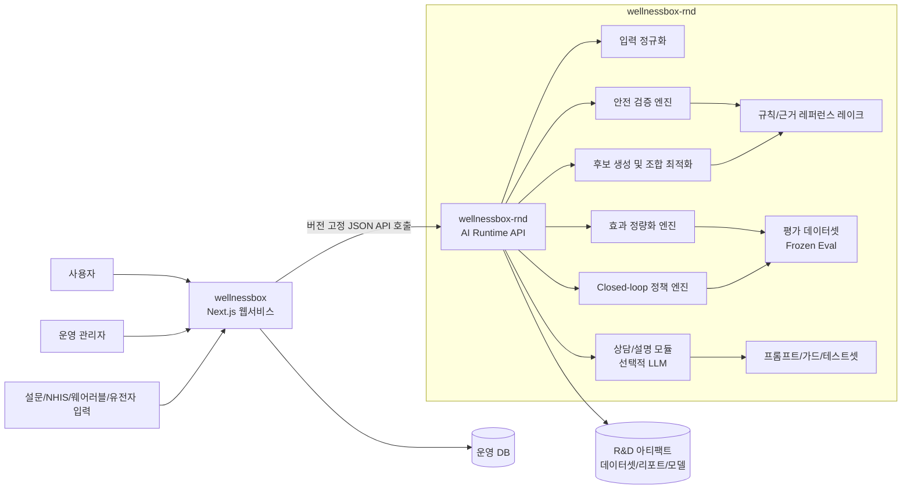
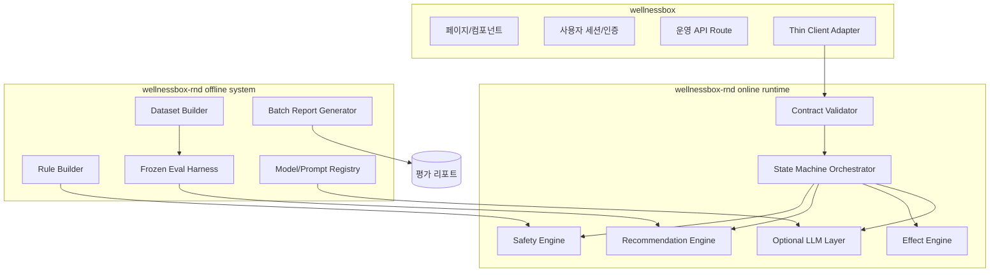

# 목표 아키텍처

기준 문서: `C:/dev/wellnessbox-rnd/docs/context/master_context.md`

## 문서 목적

- 이 문서는 `master_context.md`를 기준으로 연구개발의 최종 목표 아키텍처를 확정한다.
- 앞으로 R&D 관점의 설계, 구현, 평가, 데이터 생성, 추론 본체는 `wellnessbox-rnd`에서만 진행한다.
- `wellnessbox`는 Next.js 기반 웹서비스/UI 레이어로만 유지한다.

## 아키텍처 원칙

1. KPI 달성이 구조보다 우선이다.
2. 웹과 R&D는 하드 스플릿한다.
3. 초기 구현은 deterministic engine + structured output + eval first로 간다.
4. 안전 검증은 규칙 기반과 구조화 근거 체계가 우선이다.
5. LLM은 선택적 보조 계층이며 필수 코어가 아니다.
6. 1인 개발, 1대 컴퓨터에서 재현 가능해야 한다.
7. 학습 코드, 데이터 생성 파이프라인, 평가 하네스, 추론 본체, 모델 아티팩트는 `wellnessbox-rnd`에 둔다.

## 시스템 컨텍스트

## 최종 구조 한 줄 요약

`wellnessbox`가 입력 수집, 세션, 인증, 주문, 운영 UI를 담당하고, `wellnessbox-rnd`가 추천 정확도, 안전 검증, 효과 정량화, closed-loop 판단, 상담 정확도를 책임지는 구조다.

## 현재 구현 상태

- `apps/inference_api/main.py`에 최소 추론 API가 구현되어 있다.
- `/v1/recommend`는 이제 mock이 아니라 deterministic baseline 엔진을 호출한다.
- baseline 엔진은 `intake normalization -> safety validation -> candidate filtering -> scoring -> ranking -> templated explanation` 순서로 동작한다.
- 현재 카탈로그는 `data/catalog/ingredients.json`의 demo/placeholder catalog이며, 운영용 product SSOT는 아직 연결하지 않았다.

## 계층 구조

## 핵심 모듈

### 1. 입력 정규화 계층

- 설문, 복용 약물, 증상, 생활습관, 웨어러블, 연속혈당, 유전자 입력을 공통 스키마로 정규화한다.
- 웹이 보내는 payload를 R&D 내부 표준 `UserSnapshot`으로 변환한다.
- 결측치, 금지 입력, 단위 불일치, 날짜 정합성 검사를 여기서 끝낸다.

### 2. 안전 검증 엔진

- 약물-성분 상호작용, 과량 섭취, 금기 조건, 중복 성분, 질환별 금지 규칙을 판정한다.
- 모든 판정은 구조화된 규칙 ID와 근거 citation을 반환한다.
- 이 모듈은 KPI 5와 KPI 6의 직접 책임자다.

### 3. 추천/조합 최적화 엔진

- 안전 필터를 통과한 성분 후보를 생성한다.
- 목표 증상, 목적, 예산, 복용 편의성, 현재 복용 중인 제품을 고려해 조합을 점수화한다.
- 초기 구현은 규칙 기반 가중치 + 점수화 + 단순 탐색으로 시작한다.
- 필요 시 이후에 고전 ML 또는 contextual bandit 계층을 붙인다.

### 4. 효과 정량화 엔진

- 복용 전후 PRO 점수, 웨어러블 변화량, 선택된 바이오 지표 변화를 표준화 점수로 환산한다.
- `SCGI` 유사 지표와 내부 보조 지표를 계산한다.
- KPI 2를 실험과 운영에서 동시에 추적한다.

### 5. Closed-loop 정책 엔진

- 현재 상태에서 다음 행동이 무엇인지 결정한다.
- 예: 추천 유지, 성분 교체, 복용 중단, 추가 설문 요청, 상담 연결, 추적 알림.
- 초기에는 자유형 agent가 아니라 테스트 가능한 상태기계로 구현한다.
- KPI 3의 직접 책임자다.

### 6. 상담/설명 모듈

- 사용자 설명, FAQ, 추천 이유 설명, 근거 요약을 담당한다.
- 구조화된 안전/추천 결과를 읽어 답변을 생성한다.
- LLM은 이 계층에서만 선택적으로 사용한다.
- 모를 때 모른다고 답하고, 구조화 결과를 벗어난 임의 의료 판단을 하지 않는다.

### 7. 평가 하네스

- 추천 정확도, 상담 정확도, 안전 근거 정확도, closed-loop 정확도를 자동 측정한다.
- 운영 전 검증과 배포 후 회귀 검증의 공통 기준이다.
- 서비스보다 먼저 만들어야 하는 이유는 `master_context.md`의 KPI 우선 원칙 때문이다.

## 웹과 R&D의 책임 분리

| 구분 | `wellnessbox` | `wellnessbox-rnd` |
| --- | --- | --- |
| 주 역할 | UI, 세션, 인증, 주문, 운영 라우팅 | 규칙, 점수화, 추론, 평가, 데이터 생성 |
| 저장 | 운영 DB, 사용자 세션, 주문 정보 | 데이터셋, 룰셋, 평가 결과, 모델/프롬프트 아티팩트 |
| 계산 | 화면 표시용 얇은 변환 | 실제 안전/추천/효과/상담 판단 |
| 배포 목표 | 안정적인 웹서비스 | 재현 가능한 AI 런타임 및 실험 환경 |
| 실패 허용 | 사용자 경험 저하 최소화 | 실험 실패 가능, 하지만 평가 재현성 필수 |

## 왜 deterministic baseline을 우선하는가

1. KPI 5는 규칙과 citation의 정확도 문제이므로 생성형 모델보다 구조화 룰이 유리하다.
2. KPI 3은 다음 행동 선택 문제이므로 상태기계가 자유형 agent보다 검증 가능성이 높다.
3. KPI 2는 초대형 모델보다 안정적인 전후 비교와 표준화 점수 설계가 더 중요하다.
4. 1인 개발, 1대 컴퓨터 조건에서는 대규모 학습보다 데이터 생성과 평가 자동화가 효율적이다.
5. LLM을 뒤늦게 붙여도 core KPI 대부분은 유지할 수 있다.

## 비목표

- Next.js 내부에서 학습 파이프라인을 돌리지 않는다.
- 웹과 R&D 양쪽에 동일한 규칙, 프롬프트, 데이터 원본을 중복 저장하지 않는다.
- 초기부터 multi-agent graph를 도입하지 않는다.
- 초기부터 GPU 전용 대형 파인튜닝을 전제로 설계하지 않는다.

## 결론

- 최종 구조의 핵심은 `웹 = 운영 인터페이스`, `R&D = 판단 본체`다.
- 모든 신규 연구개발 문서와 구현은 `master_context.md`를 기준으로 `wellnessbox-rnd`에서만 진행한다.
