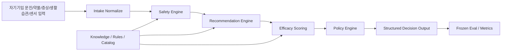
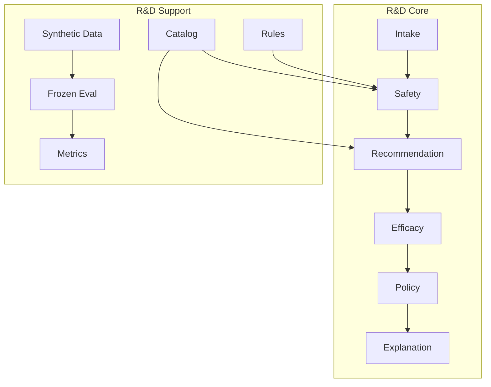

# 목표 아키텍처

기준 문서:

- `C:/dev/wellnessbox-rnd/docs/context/master_context.md`
- `C:/dev/wellnessbox-rnd/docs/context/original_plan.pdf`

## 목적

`wellnessbox-rnd` 를 독립 R&D 저장소로 유지하면서, KPI 달성에 필요한 최소/핵심 아키텍처를 고정한다.

## 핵심 원칙

1. 연구개발 source of truth 는 이 저장소 안에만 둔다.
2. deterministic baseline 과 frozen eval 이 우선이다.
3. safety / recommendation / efficacy / policy 를 구조화된 모듈로 분리한다.
4. optional LLM layer 는 가장 나중이다.
5. 특정 제품 repo 구조를 현재 아키텍처 입력으로 사용하지 않는다.

## 시스템 컨텍스트

## 모듈 구조

## 현재 구현과의 대응

- intake: `C:/dev/wellnessbox-rnd/src/wellnessbox_rnd/domain/`
- safety: `C:/dev/wellnessbox-rnd/src/wellnessbox_rnd/safety/`
- efficacy: `C:/dev/wellnessbox-rnd/src/wellnessbox_rnd/efficacy/`
- recommendation / ranking: `C:/dev/wellnessbox-rnd/src/wellnessbox_rnd/optimizer/`
- orchestration: `C:/dev/wellnessbox-rnd/src/wellnessbox_rnd/orchestration/`
- metrics / eval: `C:/dev/wellnessbox-rnd/src/wellnessbox_rnd/metrics/`, `C:/dev/wellnessbox-rnd/src/wellnessbox_rnd/evals/`

## 외부 경계

현재 범위에서는 특정 제품 연동을 정의하지 않는다.

미래에 외부 소비자가 생기더라도, 이 저장소는 아래 두 가지만 보장하면 된다.

- versioned structured API
- reproducible eval / metric 기준

## 결론

현재 목표 아키텍처는 `독립 R&D 코어 + frozen eval + deterministic runtime` 이다. 특정 웹서비스, 특정 route, 특정 운영 흐름은 현재 아키텍처의 일부가 아니다.
