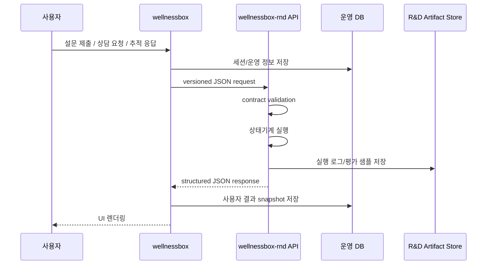
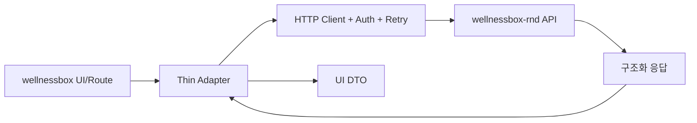

# 서비스 경계

기준 문서: `C:/dev/wellnessbox-rnd/docs/context/master_context.md`

## 경계 선언

- `wellnessbox`는 사용자-facing 웹서비스와 운영 기능만 담당한다.
- `wellnessbox-rnd`는 연구개발 로직, 규칙, 데이터셋, 평가 하네스, 모델 아티팩트, 추론 본체를 담당한다.
- 공통 원본은 한쪽에만 두고, 다른 쪽은 API contract 또는 generated schema만 사용한다.

## 책임 분리 표

| 영역 | wellnessbox 소유 | wellnessbox-rnd 소유 |
| --- | --- | --- |
| UI | 페이지, 컴포넌트, 폼, 관리자 화면 | 없음 |
| 인증/세션 | 로그인, 권한, 운영자 인증, 세션 지속 | 없음 |
| 주문/결제 | 주문 생성, 결제 조회, 상품 노출 | 없음 |
| 사용자 입력 | 설문 수집, 파일 업로드, NHIS 연동 시작 | 입력 정규화 스키마 정의 |
| 추천 계산 | 없음. API 호출만 | 추천/안전/효과/정책 계산 전부 |
| 상담 | 채팅 스트림 전달, 세션 저장 | 답변 생성 정책, 근거 제한, 평가 |
| 데이터셋 | 운영 DB에 필요한 저장만 | 합성 데이터, frozen eval, 규칙 레퍼런스 |
| 모델/프롬프트 | 보유하지 않음 | 원본 보유 |
| 배포 | Next.js 서비스 | AI runtime API, batch/eval runner |

## 표준 호출 방식

## 웹이 남기는 것

- 사용자 인증, 세션, 접근 제어
- 화면 상태와 로딩 상태
- 결제, 주문, 운영자 승인
- 사용자에게 노출할 마지막 결과 snapshot
- 장애 시 graceful fallback 처리

## 웹이 남기지 않는 것

- 안전 규칙 원본
- 추천 점수화 원본
- 프롬프트 원본
- 평가 세트 원본
- 모델 가중치와 추론 체인 원본
- 실험 로그와 연구 메모

## R&D가 제공하는 표준 API 범주

| 범주 | 예시 엔드포인트 | 응답 형식 |
| --- | --- | --- |
| 입력 정규화 | `POST /v1/intake/normalize` | `NormalizedSnapshot` |
| 안전 검증 | `POST /v1/safety/check` | `SafetyDecision` |
| 추천 생성 | `POST /v1/recommendations/plan` | `RecommendationPlan` |
| 효과 재평가 | `POST /v1/followup/evaluate` | `FollowupEvaluation` |
| 다음 행동 결정 | `POST /v1/policy/next-action` | `NextActionDecision` |
| 상담 응답 | `POST /v1/chat/answer` | `ChatAnswer` |
| 근거 조회 | `POST /v1/explanations/resolve` | `EvidenceBundle` |

## Contract 규칙

1. 응답은 자유 텍스트가 아니라 구조화 JSON을 기본으로 한다.
2. 모든 결정 응답에는 `version`, `decision_id`, `rule_refs`, `warnings`, `explanations`를 포함한다.
3. `wellnessbox`는 내부 계산을 재현하지 않고 그대로 렌더링한다.
4. 배포 시 web과 rnd의 버전 호환 테이블을 유지한다.
5. breaking change는 `v2` 엔드포인트 또는 generated contract 갱신으로만 반영한다.

## Thin Interface 원칙

- `wellnessbox` 안에 남는 AI 관련 코드는 Thin Adapter까지만 허용한다.
- 추천/상담/효과 계산 로직을 web repo 안에 다시 복제하지 않는다.
- snapshot 렌더링용 타입 매퍼는 남길 수 있지만, 원본 로직은 남기지 않는다.

## 실패 처리 기준

| 상황 | web 처리 | rnd 처리 |
| --- | --- | --- |
| API timeout | 재시도 후 사용자에게 지연 안내 | 타임아웃 원인과 run log 저장 |
| 부분 입력 누락 | 추가 입력 요청 UI | 누락 필드 목록 반환 |
| 안전 검증 실패 | 추천 차단 UI | 차단 규칙과 근거 반환 |
| 상담 confidence 부족 | FAQ/사람 검토 안내 | `cannot_answer_safely` 반환 |

## 경계 유지 규칙

1. 신규 R&D 문서는 `wellnessbox-rnd`에만 작성한다.
2. 신규 규칙, 프롬프트, 평가 세트는 `wellnessbox-rnd`에만 둔다.
3. `wellnessbox`에 AI 로직이 생기면 먼저 Thin Interface 후보인지 검토한다.
4. `master_context.md`를 벗어난 구조 결정은 ADR로만 추가한다.
