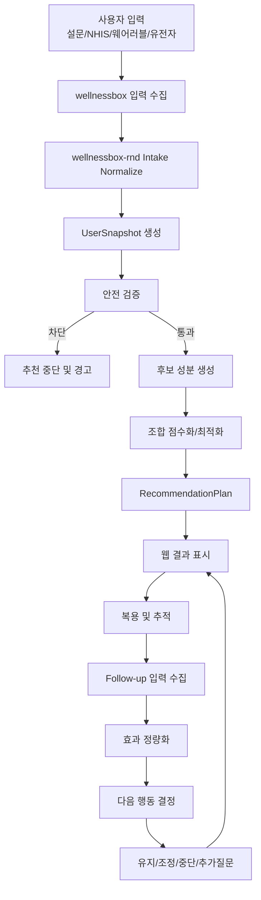
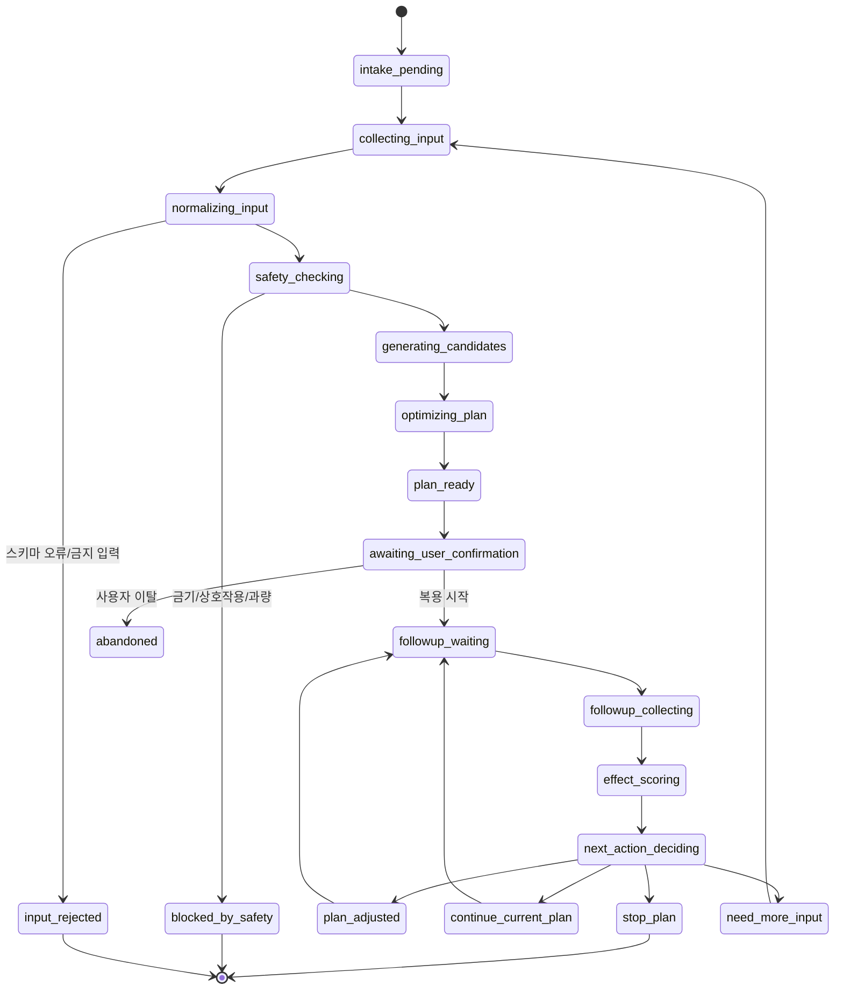
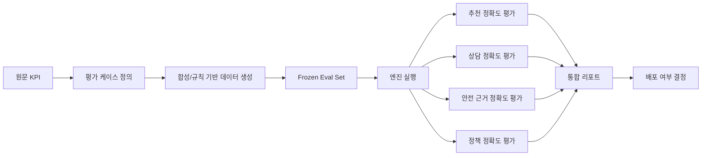

# 데이터 흐름과 상태기계

기준 문서: `C:/dev/wellnessbox-rnd/docs/context/master_context.md`

## 설계 원칙

- 추천 시스템의 핵심은 자유형 agent가 아니라 검증 가능한 상태기계다.
- 데이터 흐름은 온라인 추론 경로와 오프라인 평가 경로를 명확히 분리한다.
- 모든 주요 상태 전이는 구조화 이벤트로 기록한다.

## 온라인 데이터 흐름

## 상태기계

## 상태별 책임

| 상태 | 입력 | 출력 | 책임 모듈 |
| --- | --- | --- | --- |
| `collecting_input` | 설문, 약물, 증상, 센서 데이터 | 원시 입력 payload | web + intake adapter |
| `normalizing_input` | 원시 payload | `UserSnapshot` | 정규화 모듈 |
| `safety_checking` | `UserSnapshot` | `SafetyDecision` | 안전 검증 엔진 |
| `generating_candidates` | 안전 통과 snapshot | 후보 성분 리스트 | 후보 생성기 |
| `optimizing_plan` | 후보 리스트 | `RecommendationPlan` | 조합 최적화 엔진 |
| `effect_scoring` | 전후 추적 데이터 | `EffectScore` | 효과 정량화 엔진 |
| `next_action_deciding` | 효과 점수, adherence, 경고 | `NextActionDecision` | closed-loop 정책 엔진 |

## 오프라인 평가 흐름

## 상태 저장 원칙

### `wellnessbox`가 저장하는 것

- 사용자 세션 ID
- 요청/응답 타임스탬프
- 마지막 성공 결과 snapshot
- UI 렌더링용 상태

### `wellnessbox-rnd`가 저장하는 것

- `UserSnapshot` 버전
- 안전 판정 로그
- 추천 후보 및 점수 분해
- 효과 점수 계산 로그
- 상태 전이 이벤트
- 평가 run 결과와 회귀 리포트

## 이벤트 모델

모든 주요 상태 전이는 아래와 같은 공통 이벤트 스키마를 갖는다.

| 필드 | 의미 |
| --- | --- |
| `run_id` | 추론 실행 식별자 |
| `user_key` | 비식별 사용자 키 |
| `state_from` | 이전 상태 |
| `state_to` | 다음 상태 |
| `reason_code` | 전이 이유 |
| `rule_refs` | 관련 규칙 ID 목록 |
| `created_at` | 생성 시각 |
| `engine_version` | 엔진 버전 |

## 왜 상태기계를 우선하는가

1. KPI 3은 다음 행동 정확도 문제라서 전이 규칙이 명확해야 한다.
2. 회귀 테스트는 상태 전이 결과를 비교할 때 가장 쉽다.
3. 한 명이 운영할 때 자유형 multi-agent보다 디버깅 비용이 낮다.
4. 의학적 안전 검증은 비결정적 추론보다 규칙형 분기가 더 감사 가능하다.
