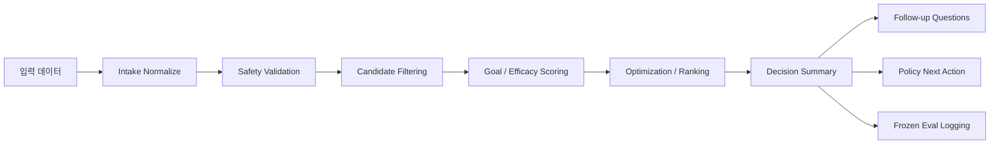
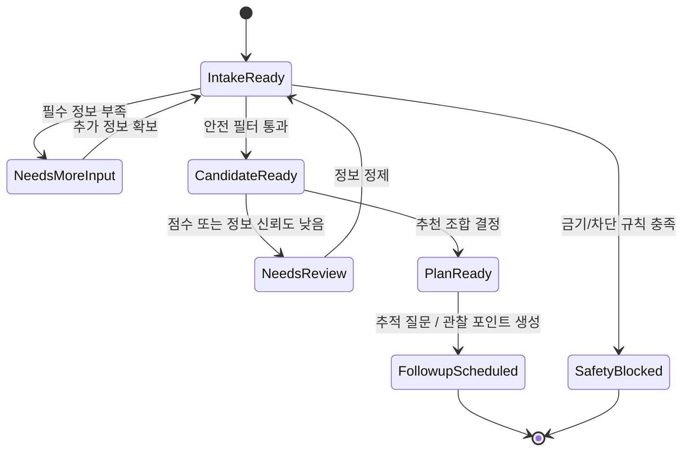

# 데이터 흐름과 상태기계

기준 문서:

- `C:/dev/wellnessbox-rnd/docs/context/master_context.md`
- `C:/dev/wellnessbox-rnd/docs/context/original_plan.pdf`

## 상위 데이터 흐름

## 입력 범주

- 자기기입 문진
- 증상
- 복용 약물
- 현재 복용 중인 건강기능식품
- 생활습관
- 센서 / 바이오마커 가용성 여부

## 상태기계

## 상태별 출력

| 상태 | 핵심 출력 |
| --- | --- |
| `NeedsMoreInput` | missing information, follow-up questions |
| `SafetyBlocked` | blocked reasons, excluded ingredients, rule refs |
| `NeedsReview` | low-confidence summary, 추가 확인 질문 |
| `PlanReady` | recommendations, rationale, follow-up window |

## 현재 코드 대응

- intake: `domain/intake.py`
- safety: `safety/service.py`
- scoring: `efficacy/service.py`
- ranking: `optimizer/service.py`
- orchestration: `orchestration/recommendation_service.py`

## 범위 밖

- 특정 제품 설문 흐름
- 특정 운영 DB 상태
- 특정 route lifecycle
