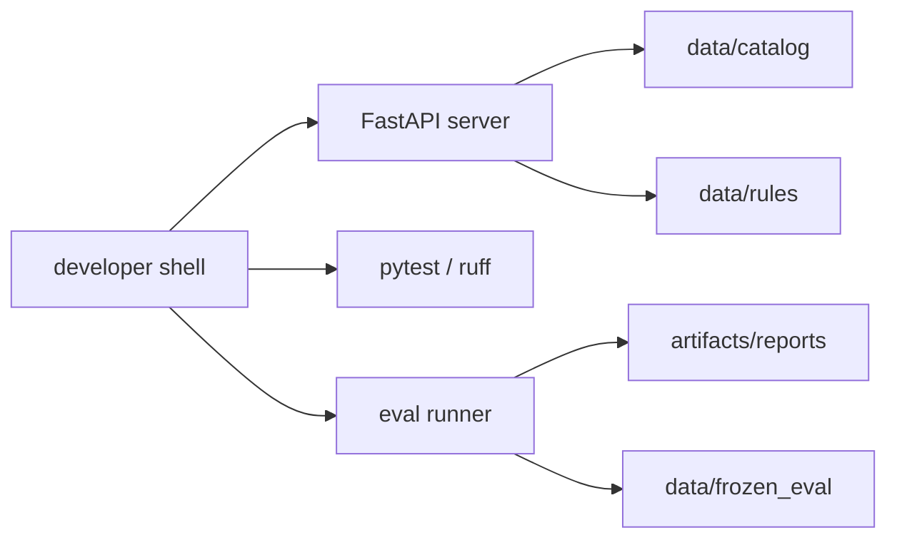

# 배포 토폴로지

기준 문서:

- `C:/dev/wellnessbox-rnd/docs/context/master_context.md`
- `C:/dev/wellnessbox-rnd/docs/context/original_plan.pdf`

## 현재 목표

1인 개발 / 1대 컴퓨터 기준에서 재현 가능한 R&D 토폴로지를 정의한다.

## 로컬 개발 구조

## 구성요소

| 구성 | 역할 |
| --- | --- |
| FastAPI server | 독립 inference runtime |
| pytest / ruff | 기본 회귀 검증 |
| eval runner | KPI 회귀 평가 |
| artifacts/reports | 평가 산출물 |
| data/catalog | ingredient catalog |
| data/rules | safety rules |
| data/frozen_eval | frozen eval dataset |

## 운영 관점 최소 원칙

- runtime 과 eval 은 분리 실행 가능해야 한다.
- generated artifact 는 `artifacts/` 아래에 둔다.
- 룰, catalog, eval dataset 은 코드와 분리해 버전 관리한다.

## 미래 통합

미래에 외부 소비자가 이 저장소의 API 를 호출할 수는 있다. 그러나 그 연결 방식과 소비자 배포 구조는 현재 범위 밖이다.
