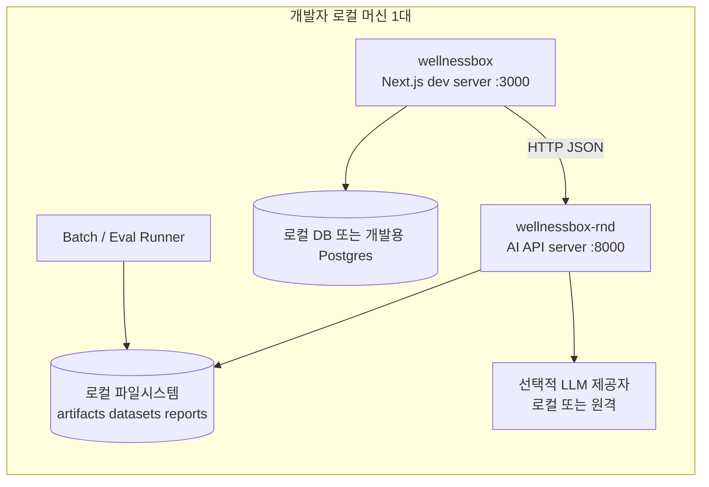
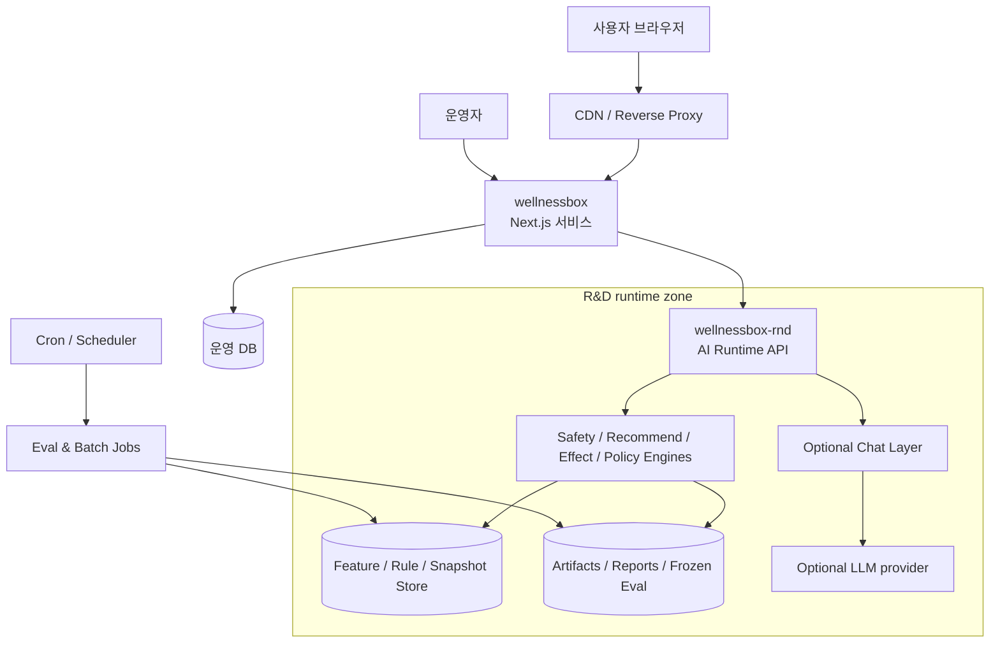

# 배포 토폴로지

기준 문서: `C:/dev/wellnessbox-rnd/docs/context/master_context.md`

## 목표

- 1인 개발, 1대 컴퓨터에서 바로 개발 가능한 구조를 우선한다.
- 운영 배포도 처음에는 단일 노드 또는 소수 노드로 단순하게 유지한다.
- 학습/평가/추론 자산은 웹서비스와 분리된 `wellnessbox-rnd` 런타임에 둔다.

## 로컬 개발 구조

## 로컬 개발 원칙

1. 두 repo는 같은 컴퓨터에서 별도 프로세스로 실행한다.
2. 웹은 `localhost`의 R&D API만 호출한다.
3. R&D 아티팩트는 repo 외부 또는 `artifacts/` 하위에 저장한다.
4. 평가 하네스는 웹과 분리된 batch 명령으로 실행한다.
5. Kubernetes, 분산 큐, 복잡한 서비스 메시를 초기 전제로 삼지 않는다.

## 권장 로컬 프로세스

| 프로세스 | 역할 | 비고 |
| --- | --- | --- |
| `wellnessbox dev` | UI 개발 | Next.js |
| `wellnessbox-rnd api` | 온라인 추론 | HTTP JSON API |
| `wellnessbox-rnd eval` | KPI 회귀 평가 | 배포 전 필수 |
| `wellnessbox-rnd batch` | 데이터 생성/규칙 빌드 | 수동 또는 cron |

## 운영 배포 구조

## 운영 원칙

### 웹 계층

- 사용자 요청 처리
- 인증, 세션, 주문, 관리자 기능
- 결과 snapshot 저장
- 사용자-facing 장애 완화

### R&D 런타임 계층

- 안전 검증
- 추천 생성
- follow-up 효과 계산
- 다음 행동 결정
- 상담 응답
- 평가 리포트 생성

### Batch/Eval 계층

- frozen eval 실행
- 규칙/지식 베이스 갱신
- synthetic dataset 생성
- 아티팩트 버전 관리

## 배포 전략

1. 초기: 단일 VM 또는 단일 개발 PC에서 web + rnd + batch를 분리 프로세스로 운영한다.
2. 중기: web과 rnd를 별도 서비스로 배포하되, eval runner는 배치 전용 노드로 분리한다.
3. 후기: 필요 시 AI runtime만 수평 확장한다.

## 저장소와 아티팩트 배치 원칙

| 종류 | 위치 |
| --- | --- |
| 웹 코드 | `wellnessbox` |
| R&D 코드 | `wellnessbox-rnd` |
| 모델 가중치 | `wellnessbox-rnd` 관리 하의 artifact storage |
| frozen eval 결과 | `wellnessbox-rnd/artifacts` 또는 외부 저장소 |
| 원문/근거 자료 | `wellnessbox-rnd/data`, `docs`, `references` |

## 금지 사항

- Next.js 서버 안에서 학습 파이프라인을 돌리지 않는다.
- 웹 repo에 모델 가중치, eval set, 프롬프트 원본을 넣지 않는다.
- web과 rnd가 같은 데이터 원본을 별도 수정하는 구조를 만들지 않는다.
