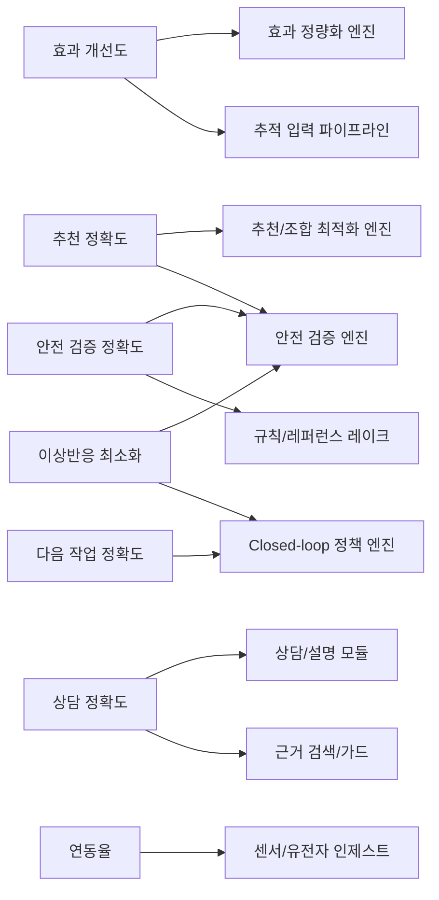

# KPI와 시스템 모듈 매핑

기준 문서: `C:/dev/wellnessbox-rnd/docs/context/master_context.md`

## KPI 우선 원칙

- 이 프로젝트의 실제 성공 기준은 `master_context.md`에 재정리된 p.25~26 KPI 달성이다.
- 프레임워크, 구현 언어, 모델 종류는 바뀔 수 있지만 KPI 책임 모듈은 명확해야 한다.

## KPI 개요

| KPI | 목표 | 가중치 | 핵심 해석 |
| --- | --- | --- | --- |
| 추천 정확도 | 80% 이상 | 20 | 정답 성분 세트 커버리지 |
| 실제 효과 개선도 | 0pp 초과 | 20 | 복용 전후 표준화 점수 개선 |
| 다음 수행 작업 정확도 | 80% 이상 | 20 | 상태기계 정책 정확도 |
| 상담 모듈 답변 정확도 | 91% 이상 | 20 | 제한된 질의 집합에서 정답 일치율 |
| 안전 검증/레퍼런스 정확도 | 95% 이상 | 10 | 구조화 규칙과 근거 일치율 |
| 약물이상반응 보고 건수 | 연 5건 이하 | 5 | 위험 추천 억제 |
| 바이오센서·유전자 연동율 | 90% 이상 | 5 | 입력 파이프라인 정합성 |

## KPI와 모듈 연결

## 상세 매핑 표

| KPI | 1차 책임 모듈 | 2차 지원 모듈 | 필요한 데이터 | 대표 평가 방식 |
| --- | --- | --- | --- | --- |
| 추천 정확도 80% | 추천/조합 최적화 엔진 | 안전 검증 엔진, 입력 정규화 | 정답 성분 세트, 후보 성분 DB, 사용자 snapshot | case 100개 이상에서 성분 커버리지 계산 |
| 효과 개선도 > 0pp | 효과 정량화 엔진 | 추적 입력 파이프라인, 정책 엔진 | 전후 PRO, 웨어러블 변화, 복용 이력 | 표준화 점수 전후 비교 |
| 다음 작업 정확도 80% | closed-loop 정책 엔진 | 상태기계 이벤트 로그 | 테스트 시나리오, 기대 액션 라벨 | 상태별 expected action 일치율 |
| 상담 정확도 91% | 상담/설명 모듈 | 근거 검색/가드, 안전 엔진 | QA 세트, 구조화 근거 bundle | 제한 질문 세트 정답률 |
| 안전/레퍼런스 정확도 95% | 안전 검증 엔진 | 규칙/레퍼런스 레이크 | 규칙 샘플, citation reference | 규칙 + citation 동시 일치율 |
| 이상반응 연 5건 이하 | 안전 엔진 | 정책 엔진, 사후 모니터링 | 위험 플래그, adverse event 보고 | 운영 모니터링 및 월간 추적 |
| 연동율 90% | 센서/유전자 인제스트 | 입력 정규화 | 연동 시도/성공 로그 | 성공 비율 계산 |

## 왜 규칙/점수화/안전검증을 먼저 만드는가

1. 추천 정확도는 성분 커버리지 문제라서 후보 생성과 점수화 품질이 우선이다.
2. 효과 개선도는 대형 모델보다 안정적인 follow-up 수집과 표준화 점수 설계가 더 중요하다.
3. 다음 작업 정확도는 명확한 상태 정의와 정책 규칙이 있어야만 측정된다.
4. 안전 검증 정확도 95%는 구조화 규칙과 citation 없이는 거의 달성할 수 없다.
5. 이상반응 최소화 KPI는 생성형 답변 품질보다 차단 규칙 품질이 더 직접적이다.

## 모듈별 KPI 책임 선언

### 안전 검증 엔진

- 직접 책임: KPI 5, KPI 6
- 간접 책임: KPI 1
- 배포 전 필수 테스트: 금기 규칙 회귀, citation 일치 테스트, 과량 경고 테스트

### 추천/조합 최적화 엔진

- 직접 책임: KPI 1
- 간접 책임: KPI 2, KPI 6
- 배포 전 필수 테스트: 정답 성분 커버리지, 비용/복용 편의성 제약 테스트

### 효과 정량화 엔진

- 직접 책임: KPI 2
- 간접 책임: KPI 3
- 배포 전 필수 테스트: score normalization, missing follow-up 처리, baseline drift 검사

### Closed-loop 정책 엔진

- 직접 책임: KPI 3
- 간접 책임: KPI 2, KPI 6
- 배포 전 필수 테스트: 상태별 expected action 회귀

### 상담/설명 모듈

- 직접 책임: KPI 4
- 간접 책임: KPI 5
- 배포 전 필수 테스트: 정답 셋 QA, hallucination 차단, 모름 응답 테스트

### 센서/유전자 인제스트

- 직접 책임: KPI 7
- 간접 책임: KPI 2
- 배포 전 필수 테스트: schema validation, unit normalization, ingestion completeness

## 운영 대시보드 최소 지표

| 분류 | 지표 |
| --- | --- |
| 추천 | 추천 생성 성공률, 후보 수, 차단율, 상위 조합 점수 |
| 효과 | follow-up 완료율, 평균 개선도, 결측 비율 |
| 정책 | 다음 행동 정확도, 재질문 비율, 중단 권고 비율 |
| 상담 | 답변 가능 비율, 안전 차단 비율, 근거 누락 비율 |
| 안전 | 금기 차단 건수, citation mismatch 건수, adverse event 추이 |
| 연동 | 센서/유전자 수집 성공률, 데이터 지연, 파싱 실패율 |

## 결론

- 이 프로젝트는 "좋은 AI 느낌"이 아니라 KPI 책임 구조가 먼저다.
- 따라서 초기 코드 범위도 평가 하네스, 안전 엔진, 조합 점수화, 상태기계부터 시작해야 한다.
