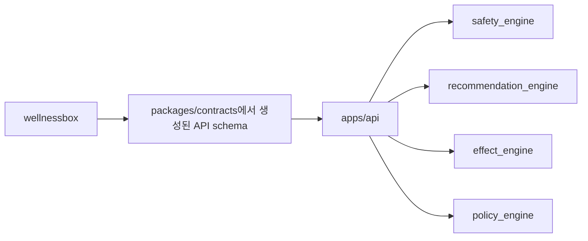

# 초기 저장소 구조

기준 문서: `C:/dev/wellnessbox-rnd/docs/context/master_context.md`

## 목표

- `wellnessbox-rnd`를 연구개발 전용 repo로 정리한다.
- 온라인 API, 오프라인 평가, 데이터 생성, 문서, 아티팩트를 분리한다.
- 1인 개발 기준으로 지나치게 복잡한 모노레포 운영은 피하되, 경계는 명확히 둔다.

## 제안 구조

```text
wellnessbox-rnd/
  docs/
    context/
    00_discovery/
    00_migration/
    01_architecture/
  apps/
    api/
    eval_runner/
    batch_ops/
  packages/
    contracts/
    intake/
    safety_engine/
    recommendation_engine/
    effect_engine/
    policy_engine/
    chat_layer/
    evidence_registry/
    observability/
  data/
    raw/
    synthetic/
    frozen_eval/
    references/
    knowledge/
  artifacts/
    runs/
    reports/
    models/
    snapshots/
  scripts/
    dev/
    eval/
    data/
    release/
  tests/
    contract/
    integration/
    regression/
    kpi/
  legacy_code/
```

## 디렉터리 설명

### `apps/api`

- 웹이 호출하는 온라인 AI API
- request validation
- 상태기계 orchestration
- thin HTTP layer

### `apps/eval_runner`

- frozen eval 실행기
- KPI 집계
- 회귀 리포트 생성

### `apps/batch_ops`

- synthetic data 생성
- 규칙/레퍼런스 빌드
- snapshot export

### `packages/contracts`

- web과 rnd가 공유하는 schema 정의
- OpenAPI, JSON Schema, typed DTO 생성 원본

### `packages/intake`

- 입력 정규화
- 단위 정리
- `UserSnapshot` 생성

### `packages/safety_engine`

- 상호작용/금기/과량 규칙
- 안전 판정
- citation bundle 반환

### `packages/recommendation_engine`

- 후보 생성
- 조합 탐색
- 점수화

### `packages/effect_engine`

- 전후 점수 정규화
- 개선도 계산
- follow-up 지표 계산

### `packages/policy_engine`

- 상태기계
- 다음 행동 선택
- 재평가 정책

### `packages/chat_layer`

- 선택적 LLM 응답 계층
- 구조화 응답 생성
- guardrail

### `packages/evidence_registry`

- 룰셋, 근거 citation, 문헌/가이드 레퍼런스 관리

### `packages/observability`

- run log
- metric emitters
- trace helpers

## `wellnessbox`와의 연결점



## 계약 관리 방식

1. 원본 contract는 `packages/contracts`에만 둔다.
2. `wellnessbox`는 generated client 또는 exported schema만 사용한다.
3. rule, prompt, eval dataset은 contract 패키지에 넣지 않는다.

## 초기 기술 선택 원칙

- 언어는 Python 또는 TypeScript 중 구현 효율이 높은 쪽을 선택할 수 있다.
- 단, API contract와 evaluation reproducibility가 우선이다.
- 프레임워크는 고정하지 않는다.
- 상태기계와 규칙 엔진은 라이브러리보다 테스트 가능성이 우선이다.

## 아티팩트 관리 원칙

| 자산 | 저장 위치 | 비고 |
| --- | --- | --- |
| frozen eval 결과 | `artifacts/reports` | 버전 태그 포함 |
| 모델 가중치 | `artifacts/models` | 필요 시 외부 저장소 가능 |
| snapshot export | `artifacts/snapshots` | web 전달용 |
| 추론 실행 로그 | `artifacts/runs` | run_id 단위 |

## 초기 폴더 생성 우선순위

1. `apps/api`
2. `packages/contracts`
3. `packages/intake`
4. `packages/safety_engine`
5. `packages/recommendation_engine`
6. `packages/effect_engine`
7. `packages/policy_engine`
8. `apps/eval_runner`
9. `data/frozen_eval`
10. `artifacts/reports`
