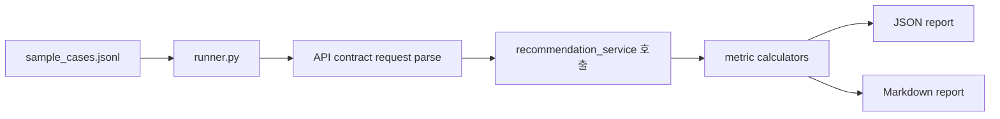

# Eval 실행 가이드

기준 문서: `C:/dev/wellnessbox-rnd/docs/context/master_context.md`

## 목적

- frozen eval을 로컬에서 바로 실행할 수 있게 한다.
- JSON/Markdown 리포트를 남겨, 구현이 바뀌어도 KPI contract가 유지되는지 비교한다.

## 실행 흐름



## 기본 명령

```bash
python scripts/run_eval.py
```

## 옵션 예시

```bash
python scripts/run_eval.py --dataset data/frozen_eval/sample_cases.jsonl --output-dir artifacts/reports
```

## 출력물

- `artifacts/reports/eval_report.json`
- `artifacts/reports/eval_report.md`

## JSON 리포트 구성

| 필드 | 설명 |
| --- | --- |
| `dataset_path` | 사용한 JSONL 경로 |
| `generated_at` | 실행 시각 |
| `summary` | metric별 score, target, pass/fail |
| `case_results` | 각 case별 actual output과 case metric |

## Markdown 리포트 구성

- 실행 시각
- dataset 경로
- metric summary table
- case별 요약

## 현재 runner의 범위

- `/v1/recommend` 경로에 대한 frozen eval
- deterministic metric 계산
- synthetic dataset 사용
- 현재 baseline 구현은 `src/wellnessbox_rnd/orchestration/recommendation_service.py`를 직접 호출한다.

## 아직 미구현 범위

- 실제 chat QA 세트 실행
- 실제 production adverse event aggregation
- 대규모 frozen eval set 버전 관리
- 모델별 비교 실행

## 운영 규칙

1. 구현 엔진을 바꾸기 전에 먼저 eval을 돌린다.
2. 변경 후 같은 dataset으로 다시 eval을 돌린다.
3. JSON report를 diff해 회귀를 본다.
4. metric 정의를 바꾸는 경우 문서와 코드 정의를 동시에 변경한다.
