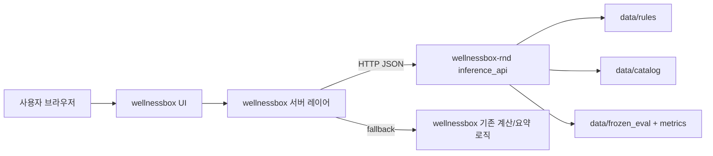
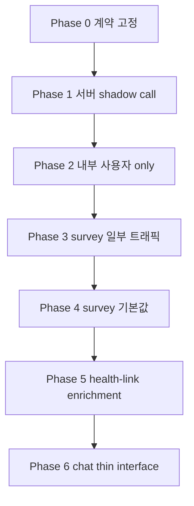

# wellnessbox <-> wellnessbox-rnd 연동 전략

## 목적

이 문서는 `wellnessbox` 웹서비스와 `wellnessbox-rnd` AI 서비스를 분리된 저장소로 유지하면서도, 실제 사용자 흐름에 최소 침습으로 연동하는 기준 문서다.

- R&D 기준 문서 원본은 `docs/context/master_context.md` 하나만 사용한다.
- `wellnessbox` 는 UI, 인증, 세션, 주문, 운영 화면, 기존 서비스 fallback 을 담당한다.
- `wellnessbox-rnd` 는 추천 의사결정, 안전 검증, 평가 체계, 모델/규칙 원본, 추론 API 를 담당한다.

## 핵심 원칙

1. 브라우저가 직접 `wellnessbox-rnd` 를 호출하지 않는다.
2. `wellnessbox` 서버 레이어가 프록시 또는 adapter 역할을 한다.
3. 1차 연동은 `/survey` 추천 결과 생성으로 시작한다.
4. 실패 시 기존 `wellnessbox` 계산 경로로 되돌아갈 수 있어야 한다.
5. feature flag, timeout, fallback, logging 을 계약과 함께 먼저 고정한다.
6. 연동 전후 KPI 비교가 가능하도록 shadow mode 를 지원한다.

## 1차 연동 우선순위

| 우선순위 | 사용자 흐름 | 현재 표면 | 연동 방식 | 이유 |
| --- | --- | --- | --- | --- |
| 1 | 설문 기반 추천 | `/survey` | `wellnessbox` 서버 -> `wellnessbox-rnd /v1/recommend` | 현재 baseline API 와 입력 구조가 가장 잘 맞음 |
| 2 | 건강 연동 요약 | `/health-link`, `/employee-report` | `wellnessbox` 서버 -> `wellnessbox-rnd` 요약 API | NHIS fetch 이후 비동기 enrichment 로 분리 가능 |
| 3 | 상담/채팅 | `/chat`, `/api/chat*` | `wellnessbox` 서버 -> `wellnessbox-rnd` chat/planner API | 현재 스트리밍/세션 구조가 있어 단계적 교체가 필요 |

## 권장 연동 토폴로지

## 서버 호출 기본 정책

- 호출 주체: `wellnessbox` server action 또는 API route
- 전송 형식: JSON over HTTPS
- 인증 방식: 내부 서비스 토큰 또는 shared secret header
- 응답 형태: versioned structured JSON
- trace 키: `request_id`, `decision_id`, `x-request-id`
- 기본 모델: sync request/response
- streaming: 채팅 계열에서만 후순위로 도입

## 최소 침습 전략

### 설문

- 현재 `app/survey/survey-page-client.tsx` 는 클라이언트에서 설문 답변을 모은다.
- 1차 구현에서는 이 데이터를 `wellnessbox` 내부 서버 endpoint 로 보낸다.
- 서버 endpoint 가 답변을 `wellnessbox-rnd` 계약 형식으로 변환해 `/v1/recommend` 를 호출한다.
- 호출 실패 또는 timeout 시 기존 `lib/wellness/analysis.ts` 결과를 fallback 으로 사용한다.

### 건강 연동

- NHIS 본체 흐름은 `wellnessbox` 에 유지한다.
- AI summary 는 fetch 완료 후 별도 enrichment 단계로 호출한다.
- AI summary 실패가 본 fetch 성공/실패를 바꾸지 않게 한다.

### 채팅

- 채팅 UI 와 세션은 `wellnessbox` 에 남긴다.
- 1차에는 채팅 route 를 건드리지 않는다.
- 2차부터 `/api/chat` 내부 planner/recommendation 보조 판단을 `wellnessbox-rnd` 로 분리한다.

## 단계별 rollout 개요

## 성공 기준

- `/survey` 에서 `wellnessbox-rnd` 추천 결과를 서버 경유로 받을 수 있다.
- latency, timeout, fallback 여부를 로그로 추적할 수 있다.
- 실패 시 기존 서비스 UX 가 깨지지 않는다.
- 동일 입력에 대해 deterministic baseline 결과가 재현 가능하다.
- 이후 thin interface 전환 시 `wellnessbox` 안에 AI 원본 로직이 더 늘어나지 않는다.
