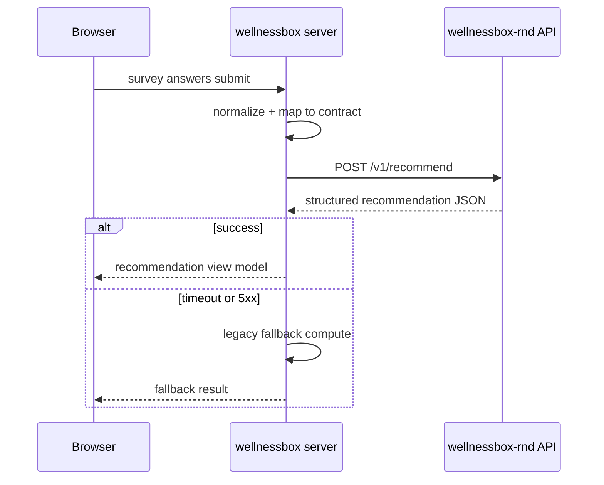

# request/response 계약

## 목적

`wellnessbox` 서버가 `wellnessbox-rnd` 추론 API 를 호출할 때 사용하는 최소 계약을 고정한다. 1차 범위는 `/v1/recommend` 다.

## 호출 주체

- 호출자: `wellnessbox` server action 또는 API route
- 피호출자: `wellnessbox-rnd` FastAPI inference API
- 전송 형식: `application/json`
- 권장 인증: `Authorization: Bearer <internal-token>` 또는 `x-wb-service-token`

## 엔드포인트

- health check: `GET /health`
- 추천 요청: `POST /v1/recommend`

## 서버 호출 방식



## request schema 요약

현재 구현 기준 원본 스키마는 `src/wellnessbox_rnd/schemas/recommendation.py` 이다.

| 필드 | 타입 | 필수 | 설명 |
| --- | --- | --- | --- |
| `request_id` | string | 선택 | web 에서 trace id 전달 가능 |
| `user_profile.age` | integer | 필수 | 만 18세 이상 |
| `user_profile.biological_sex` | enum | 필수 | `female`, `male`, `other`, `undisclosed` |
| `user_profile.pregnant` | boolean | 선택 | 안전 검증용 |
| `goals` | enum[] | 필수 | 추천 목표 |
| `symptoms` | string[] | 선택 | 증상/체감 입력 |
| `conditions` | string[] | 선택 | 질환/상태 |
| `medications` | object[] | 선택 | 현재 복용 약물 |
| `current_supplements` | object[] | 선택 | 현재 복용 건강기능식품 |
| `lifestyle` | object | 선택 | 수면, 스트레스, 활동량, 흡연, 음주 |
| `input_availability` | object | 선택 | survey, nhis, wearable, cgm, genetic 가용성 |
| `preferences` | object | 선택 | 예산, 최대 추천 개수, 회피 성분 |

## response schema 요약

| 필드 | 타입 | 설명 |
| --- | --- | --- |
| `request_id` | string | 요청 상관키 |
| `decision_id` | string | 추천 결정 식별자 |
| `status` | enum | `ok`, `needs_review`, `blocked` |
| `decision_summary` | object | headline, summary, confidence_band |
| `normalized_focus_goals` | enum[] | 정규화된 목표 |
| `safety_summary` | object | 경고, 차단 이유, 제외 성분, rule refs |
| `safety_flags` | string[] | UI 빠른 표시용 |
| `recommendations` | object[] | 선택된 성분/근거/점수/후속 관찰 포인트 |
| `next_action` | enum | `start_plan`, `collect_more_input`, `needs_human_review`, `do_not_recommend` |
| `follow_up_window_days` | integer | 다음 확인 시점 |
| `follow_up_questions` | string[] | 추적 질문 |
| `missing_information` | object[] | 누락 정보와 중요도 |
| `limitations` | string[] | 보수적 제한사항 |
| `metadata` | object | engine_version, mode, generated_at |

## TypeScript 참고 타입

```ts
type WbRndRecommendRequest = {
  request_id?: string;
  user_profile: {
    age: number;
    biological_sex: "female" | "male" | "other" | "undisclosed";
    pregnant?: boolean;
  };
  goals: Array<
    | "stress_support"
    | "sleep_support"
    | "immunity_support"
    | "energy_support"
    | "gut_health"
    | "bone_joint"
    | "heart_health"
    | "blood_glucose"
    | "general_wellness"
  >;
  symptoms?: string[];
  conditions?: string[];
  medications?: Array<{ name: string; dose?: string | null }>;
  current_supplements?: Array<{ name: string; ingredients?: string[] }>;
  lifestyle?: {
    sleep_hours?: number | null;
    stress_level?: number | null;
    activity_level?: "sedentary" | "lightly_active" | "moderately_active" | "very_active";
    smoker?: boolean;
    alcohol_per_week?: number;
  };
  input_availability?: {
    survey?: boolean;
    nhis?: boolean;
    wearable?: boolean;
    cgm?: boolean;
    genetic?: boolean;
  };
  preferences?: {
    budget_level?: "low" | "medium" | "high";
    max_products?: number;
    avoid_ingredients?: string[];
  };
};

type WbRndRecommendResponse = {
  request_id: string;
  decision_id: string;
  status: "ok" | "needs_review" | "blocked";
  decision_summary: {
    headline: string;
    summary: string;
    confidence_band: "low" | "medium" | "high";
  };
  normalized_focus_goals: string[];
  safety_summary: {
    status: "ok" | "needs_review" | "blocked";
    warnings: string[];
    blocked_reasons: string[];
    excluded_ingredients: string[];
    rule_refs: Array<{
      rule_id: string;
      message: string;
      severity: "info" | "warning" | "blocker";
      source: string;
    }>;
  };
  safety_flags: string[];
  recommendations: Array<{
    ingredient_key: string;
    display_name: string;
    rationale: string;
    expected_support_goals: string[];
    rule_refs: string[];
    follow_up_focus: string;
    score_breakdown: {
      goal_alignment: number;
      symptom_alignment: number;
      lifestyle_alignment: number;
      evidence_readiness: number;
      budget_adjustment: number;
      safety_adjustment: number;
      total: number;
    };
  }>;
  next_action:
    | "start_plan"
    | "collect_more_input"
    | "needs_human_review"
    | "do_not_recommend";
  follow_up_window_days: number;
  follow_up_questions: string[];
  missing_information: Array<{
    code: string;
    question: string;
    reason: string;
    importance: "low" | "medium" | "high";
  }>;
  limitations: string[];
  metadata: {
    engine_version: string;
    mode: string;
    generated_at: string;
  };
};
```

## survey -> contract 매핑 초안

| survey/runtime 원천 | contract 필드 | 비고 |
| --- | --- | --- |
| 사용자 기본정보 | `user_profile` | 연령/성별/임신 여부 |
| 설문 목적/관심사 | `goals` | enum 매핑 테이블 필요 |
| 자각 증상 답변 | `symptoms` | string token 으로 시작, 추후 controlled vocab |
| 기저 질환/상태 | `conditions` | 고위험 condition 우선 |
| 복용 약 정보 | `medications` | 약명만 우선, 용량은 선택 |
| 건강기능식품 복용 현황 | `current_supplements` | 중복 성분 제거에 사용 |
| 수면/스트레스/활동량 | `lifestyle` | survey 가 기본, NHIS/wearable 는 후순위 |
| 데이터 연동 여부 | `input_availability` | survey/nhis/wearable/cgm/genetic |
| 예산/회피 성분/최대 개수 | `preferences` | 1차에는 일부만 노출 가능 |

## 계약 버전 규칙

- URL 버전: `/v1/recommend`
- breaking change: `/v2/...`
- non-breaking field 추가: 같은 버전 유지 가능
- `metadata.engine_version` 으로 엔진 버전을 별도 추적

## 보안/민감정보 원칙

- 브라우저에 service token 을 노출하지 않는다.
- `wellnessbox` 로그에는 원문 주민/인증정보를 저장하지 않는다.
- `wellnessbox-rnd` 에는 추천에 필요한 최소 입력만 전달한다.
