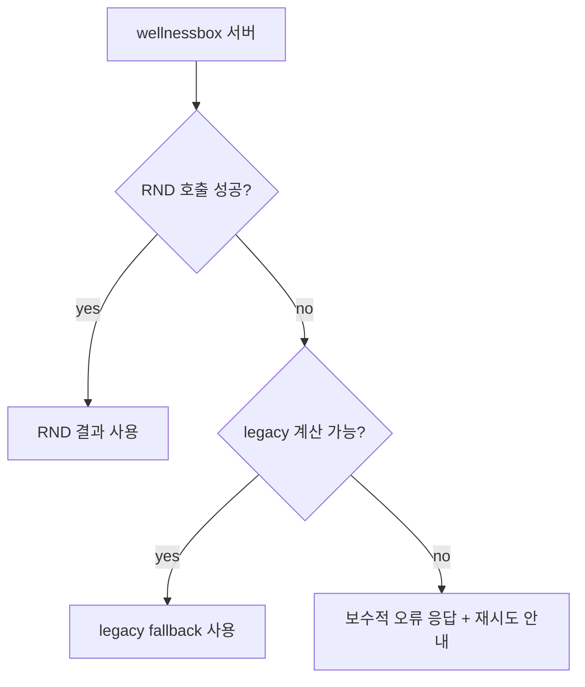

# error / timeout / fallback 정책

## 목표

연동 실패가 곧바로 사용자 경험 붕괴로 이어지지 않도록, `wellnessbox` 가 항상 제어권을 가지는 정책을 고정한다.

## timeout budget

| 흐름 | soft target | hard timeout | 실패 시 기본 동작 |
| --- | --- | --- | --- |
| 설문 추천 `/v1/recommend` | 1.5초 | 4초 | 기존 `lib/wellness/analysis.ts` fallback |
| 건강연동 AI summary | 1초 | 2.5초 | summary 생략, NHIS 본문 결과 유지 |
| 채팅 planner/helper | 3초 | 8초 | 기존 `/api/chat` 체인 유지 |

## 실패 유형별 정책

| 실패 유형 | wellnessbox 처리 | 사용자 UX | 로그 |
| --- | --- | --- | --- |
| network error | fallback 전환 | 기존 결과 유지 | `network_error` |
| timeout | fallback 전환 | 느린 응답 메시지 없이 기존 결과 유지 | `timeout` |
| 4xx contract error | 서버 측 validation error 로 기록 | 사용자에게 일반 오류 대신 fallback | `contract_error` |
| 5xx upstream error | fallback 전환 | 기존 결과 유지 | `upstream_5xx` |
| malformed JSON | fallback 전환 | 기존 결과 유지 | `decode_error` |
| blocked recommendation | 정상 응답으로 처리 | 차단 사유와 추가 확인 질문 노출 | `blocked_decision` |

## fallback 계층

## 설문 fallback UX

- 기본 원칙: 사용자에게 "AI 서버가 실패했다"는 내부 구조를 직접 노출하지 않는다.
- 1차 rollout 에서는 fallback 발생 시에도 기존 결과 화면을 보여준다.
- 필요 시 내부 운영자용 flag 에서만 fallback 배지 또는 debug trace 를 노출한다.

## 건강연동 fallback UX

- NHIS fetch 성공이 우선이다.
- `aiSummary` 생성 실패는 경고성 로그만 남기고 화면은 계속 보여준다.
- UI 에서는 "AI 요약을 준비 중입니다" 정도의 비차단 메시지만 허용한다.

## 채팅 fallback UX

- 1차 rollout 전에는 기존 `/api/chat` 이 기본값이다.
- 후속 단계에서 `wellnessbox-rnd` helper 를 붙여도 실패 시 기존 체인으로 즉시 회귀한다.
- 스트리밍 중간 실패는 현재 안전 메시지 정책을 그대로 유지한다.

## logging / observability

필수 로그 필드:

- `request_id`
- `decision_id`
- `feature_flag_state`
- `rollout_bucket`
- `latency_ms`
- `timeout_ms`
- `fallback_used`
- `fallback_reason`
- `status_code`
- `engine_version`
- `route_name`

권장 메트릭:

- route 별 `rnd_call_count`
- route 별 `rnd_timeout_count`
- route 별 `fallback_rate`
- route 별 `p50/p95 latency`
- `blocked_decision_rate`
- `missing_information_rate`

## caching 정책

### 서버 캐시

- 추천 결과는 `normalized_request_hash + engine_version` 단위로 짧게 캐시 가능
- 권장 TTL: 5분 ~ 30분
- 세션 중 중복 submit 방지와 shadow 비교에 사용

### 클라이언트 캐시

- 민감 결과를 장기 저장하지 않는다
- 화면 이동 중 임시 상태 유지 정도만 허용한다

### 금지

- service token 이 포함된 응답 캐시 금지
- 개인 식별 원문을 키로 쓰는 캐시 금지

## 에러 분류 코드 초안

| 코드 | 의미 |
| --- | --- |
| `RND_TIMEOUT` | 지정 시간 내 응답 없음 |
| `RND_UNAVAILABLE` | 네트워크/연결 실패 |
| `RND_BAD_RESPONSE` | 응답 구조 불일치 |
| `RND_CONTRACT_REJECTED` | 요청 검증 실패 |
| `RND_BLOCKED_DECISION` | 안전 사유로 추천 차단 |
| `RND_FALLBACK_USED` | fallback 적용 |

## 운영 원칙

- 장애 시 가장 먼저 지키는 것은 사용자 흐름 지속성이다.
- KPI 비교를 위해 shadow 결과와 실제 표시 결과를 분리 기록한다.
- fallback 이 일정 비율을 넘으면 rollout 을 즉시 되돌릴 수 있어야 한다.
